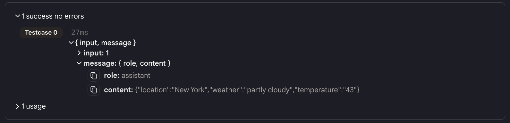
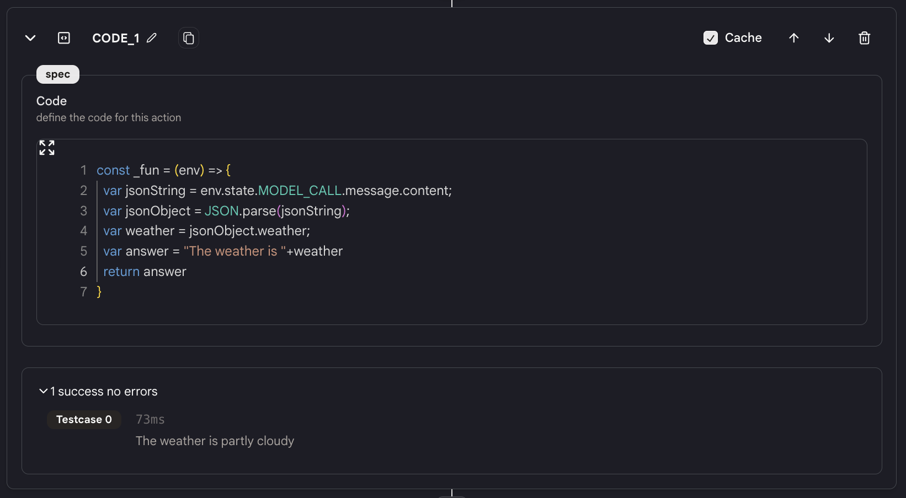
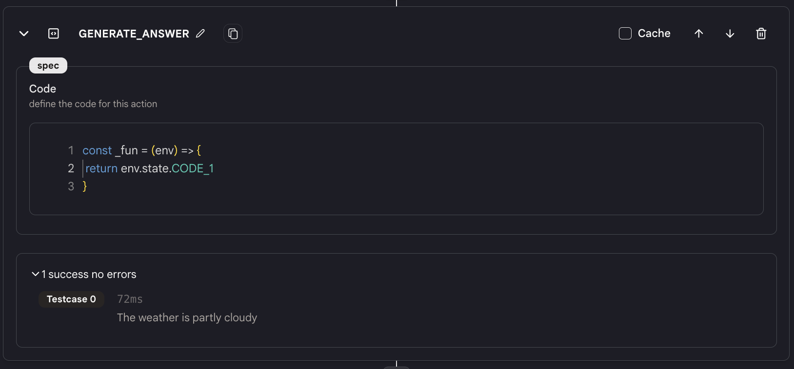

# 代码

`代码`动作是一个非常常用的动作。它允许你编写 Javascript 代码来以任何方式处理来自前序动作的数据。

## 使用方法

**一般用法**

* 要使用`代码`动作，首先将一个`代码`动作添加到你的代理中。

* 在这里编写任何 Javascript 代码来处理来自前序动作的数据，并将数据发送到后续动作。

**缓存**

* 在`代码`动作的右上角有一个`缓存`按钮。如果你打开它，结果将被缓存。如果`代码`动作的输入和代码相同，结果将直接从缓存中返回。这可以大大提高你的代理的性能。

## 示例

<figure></figure>

* 例如，如果`MODEL_CALL`动作返回了一个包含 JSON 字符串的消息，如：`"{"location":"New York","weather":"parly couldy","temperatuee":"43"}"`。

* 而你想从这个 JSON 中获取"weather"字段。你可以添加一个`代码`动作（命名为"CODE_1"）并编写以下代码：

```javascript
const _fun = (env) => {
  var jsonString = env.state.MODEL_CALL.message.content;
  var jsonObject = JSON.parse(jsonString);
  var weather = jsonObject.weather;
  return weather;
}
```

<figure></figure>

* 现在你可以使用 {{CODE_1}} 或 env.state.CODE_1 来获取"weather"字段的值。

<figure></figure>

## 示例代理

你可以在以下代理中找到上面示例中显示的代码。

[代码动作](https://rebyte.ai/p/21b2295005587a5375d8/callable/4929456b3b6bfcee316d/editor)