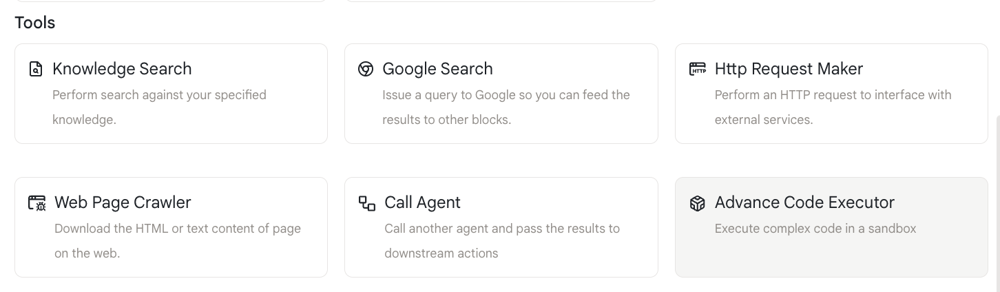
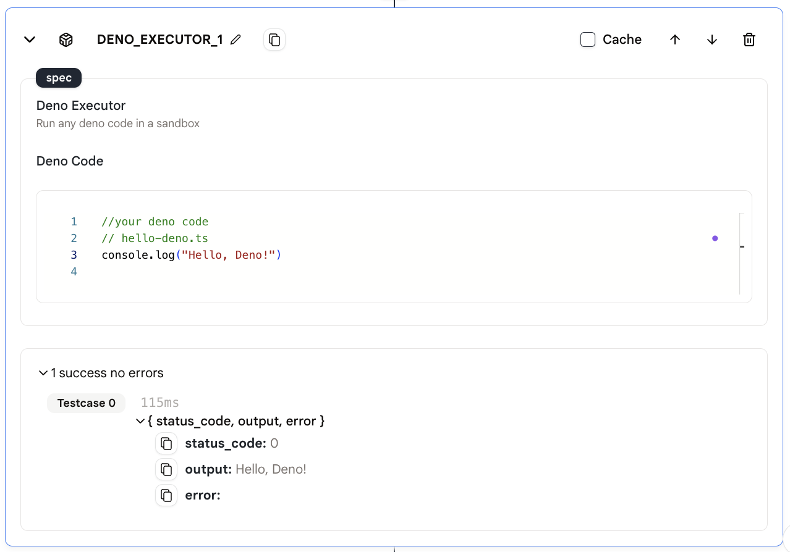

# 高级代码执行器

我们提供`高级代码执行器`动作来在沙箱中运行您的代码。

## 使用方法

* 在您的代理中添加一个`高级代码执行器`动作。

<figure></figure>

* 在"Deno代码"中填入您想要运行的代码。您可以输入一些代码或引用其他动作的输出。
  
* **注意：** 必须是JavaScript或TypeScript代码

<figure></figure>

## 输出

此动作的输出是上面显示的代码执行结果。

