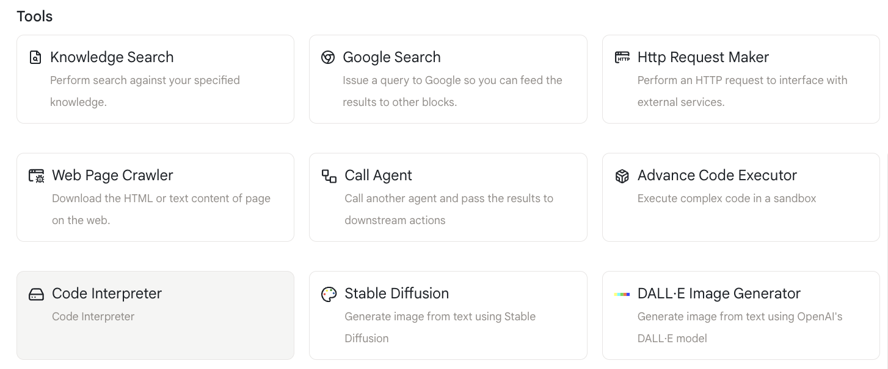
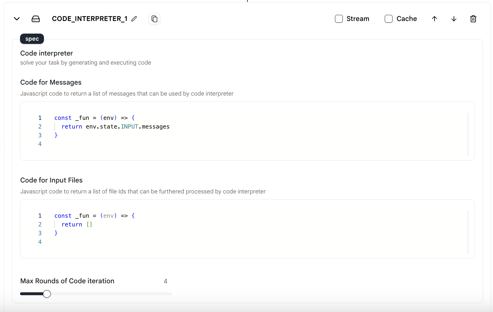
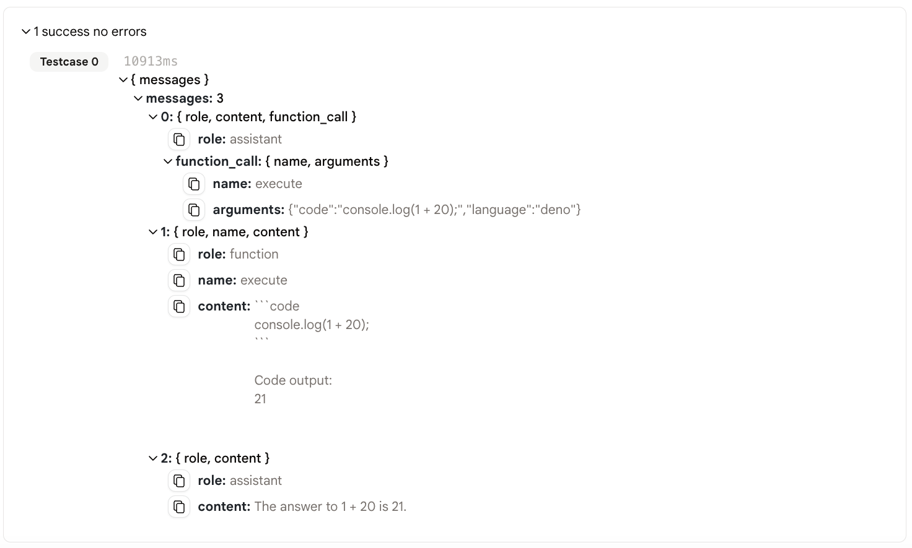

# 代码解释器

我们提供`代码解释器`动作来通过生成和执行代码来解决您的任务。

## 使用方法

* 在您的代理中添加一个`代码解释器`动作。

<figure></figure>

* 在"消息代码"中填入作为"代码解释器"动作的输入内容。

<figure></figure>
  
* 设置"代码交互最大轮数"来限制代码解释器的消息数量。

## 输出

此动作的输出如下所示：

<figure></figure>

