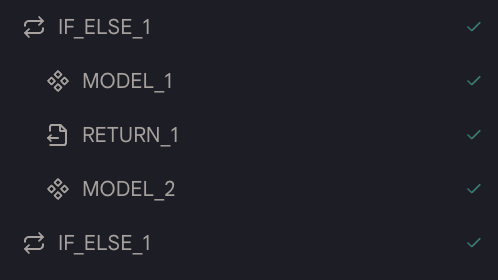

# 提前返回

这个动作允许你提前返回结果，而不运行代理中的其余动作。当你想要提前返回结果而不运行剩余的动作时，这非常有用。

## 使用方法

* 你不需要为这个动作设置任何东西。只需将它添加到你想要提前返回的位置。

* 这通常在`如果-否则`动作中使用。例如，你可以在`如果`块中添加一个`提前返回`动作，如果条件为真，系统将提前返回结果。否则，系统将跳过`如果`块中的动作并继续运行其他动作。

<figure></figure>

## 示例代理

[提前返回](https://rebyte.ai/p/21b2295005587a5375d8/callable/6b342c4a4042ccc17e58/editor#3)