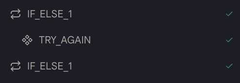
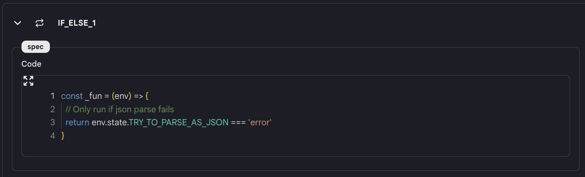

# 如果-否则

`如果-否则`动作允许你有条件地运行动作。

## 使用方法

* 向你的代理添加一个`如果-否则`动作，你会看到两个具有相同名称的块（例如"IF_ELSE_1"）被添加到动作中。

<figure></figure>
  
* 以 Javascript 格式填写条件。这个函数应该返回一个布尔值。

<figure></figure>
  
* 在执行过程中，系统将判断条件是否为真。如果是，第一个和第二个`如果-否则`块之间的动作将被执行。否则，执行将跳到第二个`如果-否则`块之后。

* **注意**："如果-否则"动作的结果是数组。确保使用像 `env.state.LOOP_1[0]` 或 `{{LOOP_1[0]}}` 这样的格式。

## 示例代理

* [如果-否则代理](https://rebyte.ai/p/21b2295005587a5375d8/callable/f6f55d6029c8a0aedd53/editor)
