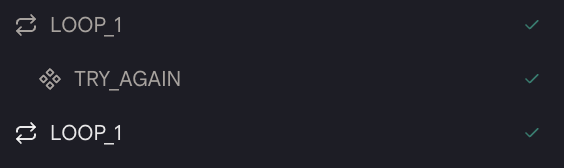
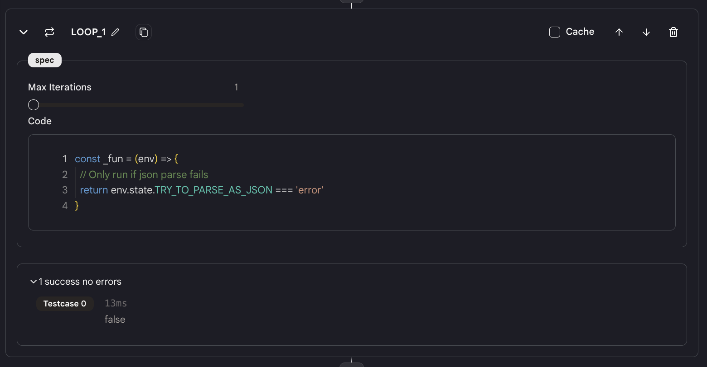

# 循环

这个`循环`动作允许你在条件为真时重复运行动作。

## 使用方法

* 首先，创建一个`循环直到`动作，你将看到两个"循环"块被创建。

<figure></figure>
  
* 以 Javascript 格式填写条件。这个函数应该返回一个布尔值。
  
* 你还可以设置最大迭代次数。如果迭代次数达到最大迭代次数，即使条件仍然为真，循环也会停止。

<figure></figure>

* 然后，添加你想在循环内运行的动作。

* 在执行过程中，系统将判断条件是否为真。如果是，两个循环块之间的动作将被执行，直到条件不再为真。否则，执行将跳到第二个循环块之后。

* **注意**："循环"动作的结果是数组。确保使用像 `env.state.LOOP_1[0]` 或 `{{LOOP_1[0]}}` 这样的格式。

## 示例代理

* [循环直到](https://rebyte.ai/p/21b2295005587a5375d8/callable/0029ec181e52a9fc2bc3/editor)
