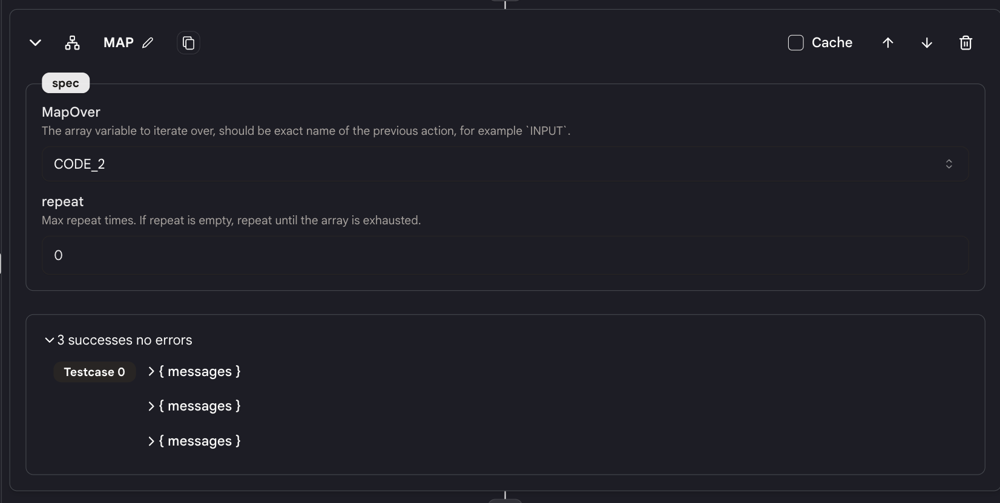

# 映射归约

`映射归约`动作允许你对一个数组进行映射并并行执行一系列动作。

这对于并行执行多个动作很有用，比如抓取多个网页。

## 使用方法

* 向你的代理添加一个`映射归约`动作，你会看到两个具有相同名称的块（例如"MAP_REDUCE_1"）被添加到动作中。

* 添加在两个块之间的动作将为数组中的每个元素并行执行。

<figure></figure>

* 为`映射归约`动作设置以下规格：

### 规格

<figure></figure>

**映射对象**

  * 选择一个前序动作，我们将对这个动作的输出进行映射。
  * 前序动作的输出必须是一个数组。同时确保数组不为空。

**重复次数**

* 该值将指定最大迭代次数
* 如果未指定"重复"值，则当数组用尽时迭代将停止。有一个64次迭代的硬性限制。
* 如果指定了"重复"值，则当数组用尽或迭代次数达到重复值时（以先到者为准），迭代将停止。

### 输出

* 映射归约动作内的每个动作将输出一个值数组。