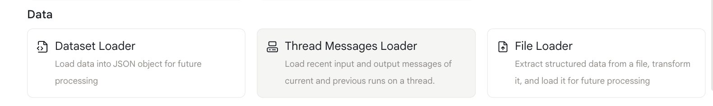
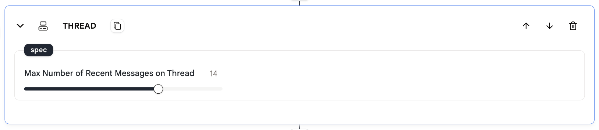

# 线程消息加载器

此操作允许您配置"线程"记忆的历史消息数量，这些消息将在使用此代理时发送给大型语言模型。

每次代理收到新消息时，"线程"将用新消息更新，并添加相应数量的历史消息作为内容，然后发送给大型语言模型。

## 使用方法

* 向您的代理添加一个"线程消息加载器"操作。

<figure></figure>
  
* 指定"线程"要记忆的消息数量。

<figure></figure>

* "线程"记忆的消息数量可能会影响大型语言模型的性能。
  
* **记忆的消息越多**，大型语言模型获得的**上下文就越多**，但这也会增加大型语言模型的响应时间。