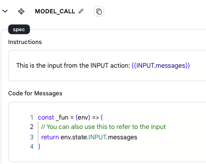

# 输入

* `输入操作`用于向代理发送输入信息。其他操作基于这些输入信息执行正确的操作。

* 代理中的第一个操作必须是`输入操作`，您不能删除或复制它。

* 在设计模式下，您可以指定一个数据集作为输入，这个数据集中的每条数据（每一行）将被视为代理的单独输入，所有输入将并行运行。每条数据行将收到一个单独的线程ID。

* 在生产模式下，输入通过代理API传递。

* Rebyte定义了一个通用数据结构来处理传入代理的消息，强烈建议使用这种格式，以使您的代理能够与助手/线程API无缝工作。

## 通用消息格式

不同的LLM有不同的消息格式，但Rebyte定义了一个通用消息格式来处理传入代理的消息，内部我们将处理所有兼容性问题。

**文本消息**
```json
{
  "role": "此消息的角色，例如用户、助手",
  "content": "此消息的内容字符串"
}
```

**带图片URL的消息**
```json
{
  "role": "user",
  "content": "此消息的内容字符串",
  "parts": [
    {
      "type": "image_url",
      "image_url": {
        "url": "此图片的url"
      }
    }
  ]
}
```

**带图片数据的消息**
```json
{
  "role": "user",
  "content": "此消息的内容字符串",
  "parts": [
    {
      "type": "blob",
      "blob": {
        "mime_type": "image/png",
        "url": "base64编码的图片数据"
      }
    }
  ]
}
```

**带文件的消息**
```json
{
  "role": "此消息的角色，例如用户、助手",
  "content": "此消息的内容字符串",
  "parts": [
    {
      "type": "file",
      "file": {
        "id": "此文件的uuid",
        "name": "此文件的名称，带扩展名"
      }
    }
  ]
}
```

**多条消息**

```json
{
  "messages": [
    {
      "role": "",
      "content": "",
      "parts": [
      ]
    },
    {
      "role": "",
      "content": "",
      "parts": [
      ]
    }
  ]
}
```

**重要**
只有符合此格式的消息才会自动保存到线程中，其他消息将被忽略

## 使用方法

您可以在指令中使用`{{INPUT.message}}`变量或在代码编辑器中使用`env.state.INPUT.messages`来使用输入。

<figure></figure>

## 数据格式

* 在代理页面中使用时，输入从预定义的数据集中提取。

* 当连接到应用程序时，输入来自应用程序用户的输入和对话历史。默认情况下，我们会将最后10条消息发送给代理。

* 输入数据格式如下：

    ```json
    {
    "messages":[{
            "role": "user",
            "content": "内容。"
        },
        {
            "role": "assistant",
            "content": "内容。"
        }]
    }
    ```

<!-- ### 参数

- 输入类型
    - 从预定义的数据集中选择
    - 当连接到聊天时，默认情况下最新的10条历史对话将作为输入信息发送给代理，格式如下
    
    ```json
    {
    "Messages":[
    {
        "role": "user",
        "content": "内容。"
    },
    {
        "role": "assistant",
        "content": "内容。"
    }
    ]
    }
    ```
    - 输出
        - 输出正确的数据 -->