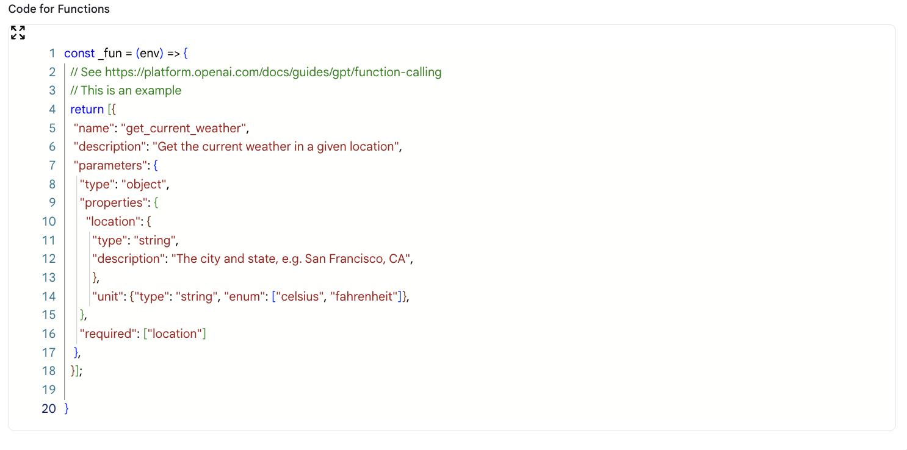
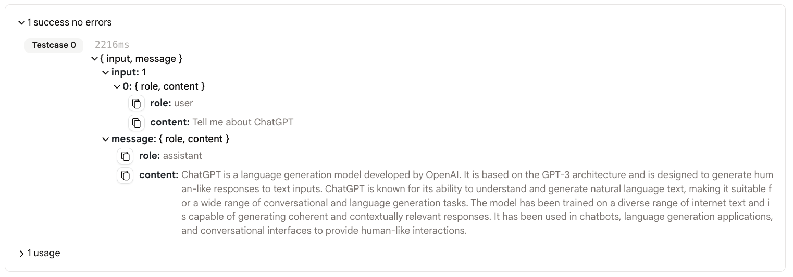

# 函数调用

## 示例1

这是一个如何使用"函数"功能的简单演示。

* 首先，取消"函数"部分代码的注释。

<figure></figure>

* 这是一个天气API的详细描述。您可以使用这个API来获取城市的天气信息。

* 对于任何给定的输入，模型都会判断是否需要调用您的函数。
  
* 如果需要，它会给您一个包含调用函数所需参数的json。
  
<figure></figure>

* 否则，它会像普通聊天机器人一样回应。

<figure></figure>

* **注意**：如果您使用"函数"功能，您应该使用另一个动作来调用实际的函数API。语言模型只会给您调用函数API所需的参数。

## 示例2

这是一个更复杂的"函数"功能使用示例。

我将向您展示如何使用"函数"功能，以及如何将"函数"功能的结果连接到"Http请求制作器"来调用实际的函数API。

