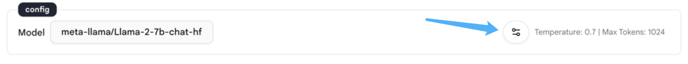
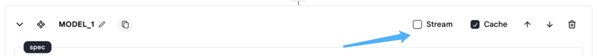

# 语言模型聊天

## 使用方法

我们提供了`Language Model Chat`操作，以便轻松地与大型语言模型进行对话并创建复杂的用途。

要使用此操作，您只需编写您的规范并配置模型，大型语言模型就会生成响应。

### 规范

<figure><figcaption></figcaption></figure>

**指令**

* 这是将发送给模型的消息。
* 在这里编写您的提示，告诉大型语言模型要做什么。
* 支持 [Tera](https://keats.github.io/tera/docs/) 格式。例如，您可以使用 `{{INPUT.messages[0].content}}` 来获取代理输入的第一条消息的内容。

**消息**

* 这是将发送给LLM的消息。
* 您可以在这里使用JavaScript或Tera格式引用其他操作的输出。
* 消息可以是字符串列表或对象列表。如果是对象列表，确保每个对象都有一个`role`字段和一个`content`字段：
  * `role`字段指定消息的角色，允许的角色有`user`、`assistant`和`system`。
  * `content`包含要发送给模型的消息。
* 使用**JavaScript**格式，例如，您可以使用`env.state.INPUT.messages`来获取代理的输入。
* **注意：**确保返回一个数组。
* **注意：**如果您希望模型聊天有上下文，应该使用`线程消息加载器`操作来记录和加载历史消息。有关此操作的更多信息，请参见[此处](../tools/thread-message-loader.md)。

**函数**

* 函数调用允许您通过在API调用中描述函数来将大型语言模型连接到外部工具，使模型能够智能地生成包含用于调用一个或多个函数的参数的JSON对象。
* 这种能力提供了一种从模型获取结构化数据的方法，使得诸如创建与外部API交互的助手和将自然语言转换为API调用等任务成为可能。
* 使用**JavaScript**格式。
* [这里](function-calling.md)有一个关于如何使用"函数"的详细示例。

### 配置

您可以通过点击模型名称来选择要使用的模型，默认模型是"gpt-3.5-turbo-1106"。

<figure><figcaption></figcaption></figure>

&#x20;

点击`语言模型聊天`操作右下角的这个按钮来打开配置面板。

<figure><figcaption></figcaption></figure>

&#x20;

配置面板中有五个设置，如下所示。

<div align="center">

<figure><figcaption></figcaption></figure>

</div>

**温度**

* "温度"控制模型输出的随机性。
* 模型温度越高，输出就越随机。

**最大输出令牌数**

* "最大输出令牌数"指定要生成的最大令牌数。
* 可以使用最多40,000个令牌（不同模型的限制不同），包括提示和模型返回的内容。

**JSON响应**

* "JSON响应"按钮启用JSON模式，保证模型生成的消息是JSON格式的。
* 注意：这是一个测试功能，目前只有OpenAI的"gpt-4-1106-preview"模型支持。
* 注意：当您使用此功能时，确保上下文中包含"JSON"这个词。否则，OpenAI的API会抛出错误。

**种子**

* "种子"是一个可以在使用`语言模型聊天`和`语言模型完成`操作时指定的参数。
* 它通过使系统确定性地采样来帮助确保输出一致，对于具有相同种子和参数的重复请求会产生相同的结果。
* 注意：这是一个测试功能，可能并非所有模型都支持。

**停止词**

* 停止词用于使模型在所需的点停止，例如句子或列表的结尾。

&#x20;

在操作的右上角，还有两个需要配置的东西："流模式"和"缓存模式"。

<figure><figcaption></figcaption></figure>

**流**

* 此选项允许您在生成部分聊天响应时接收它们，而不是等待整个完成过程结束后才接收响应。
* 通过设置流模式，您可以在接收到完整响应之前开始处理或显示聊天的开头部分。

**缓存**

* 缓存涉及存储频繁访问的数据，以改善响应时间，而无需重复调用模型。
* 如果您使用缓存模式，模型将缓存响应，并在再次发出相同请求时返回缓存的响应。这将使您的代理运行得更快。

### 消息格式

Rebyte使用类似于OpenAI的消息格式。消息格式是一个具有以下字段的JSON对象：

* Role：可以是'user'、'system'或'assistant'之一。
* Content：此消息的内容。
* Name（可选）：角色的名称。
* Context（可选）：此消息的上下文。

&#x20;

**消息格式示例**

1.简单消息

```json
{
    "content": "你好，你好吗？",
    "role": "user"
    "name": "meowoof"
    "context": {
        "files": [
    {
                "uuid": "f3610fef-f490-4675-81fe-df04735f5058",
                "name": "file1.pdf"
            },
            {
                "name": "f3610fef-f490-4675-81fe-df04735f5059",
                "content": "file2.txt"
            }   
    }
}
```

2.消息列表

```json
[
    {
        "content": "你正在与一个聊天机器人对话！",
        "role": "system"
    },
    {
        "content": "你好，你好吗？",
        "role": "user"
        "name": "meowoof"
    },
    {
        "content": "我很好，谢谢。",
        "role": "assistant"
        "name": "rebyte"
    },
    {
        "content": "你今天有什么计划？",
        "role": "user"
        "name": "meowoof"
    }
]
```

## 示例代理

* [语言模型聊天](https://rebyte.ai/p/21b2295005587a5375d8/callable/719d2f31bf9fe977f699/editor)
