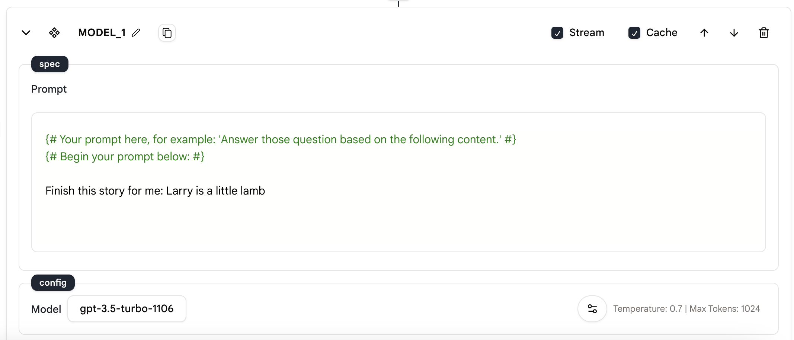
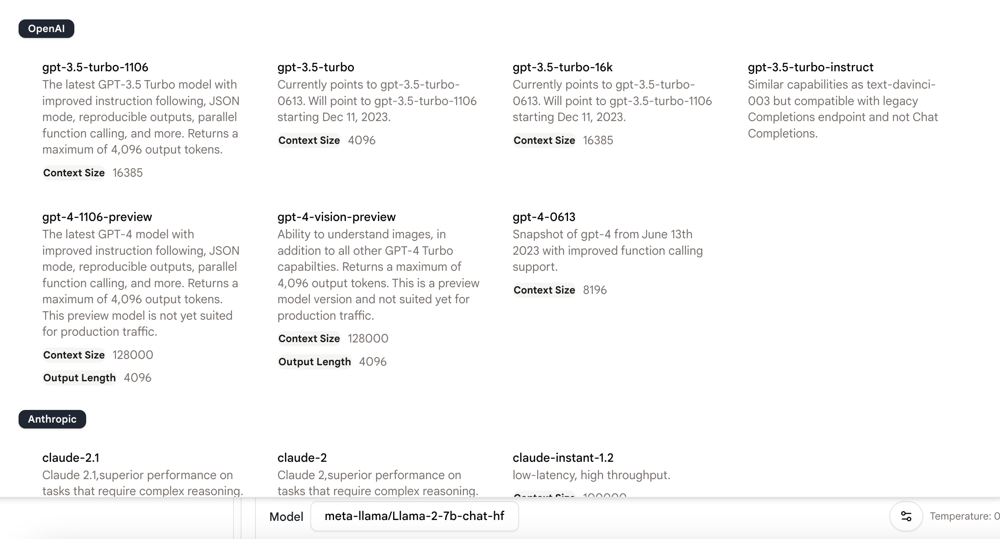
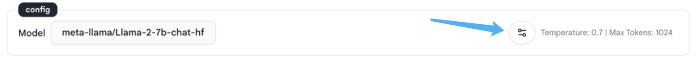
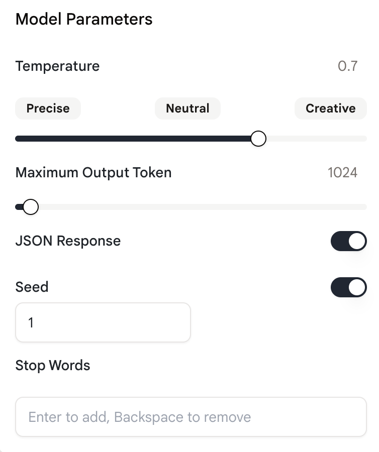
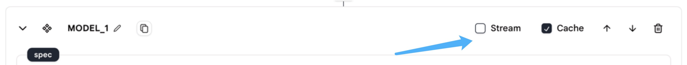

# 语言模型补全

我们提供`语言模型补全`动作让语言模型完成您的提示。

## 使用方法

* 在您的代理中添加一个`语言模型补全`动作。
* 使用规范和参数配置该动作。

### 规范

<figure><figcaption></figcaption></figure>

**提示**

* 这是将发送给模型的提示。
* 模型将完成您的提示并返回完成的内容。

### 配置

配置与[语言模型聊天](language-model-chat.md)相同。

您可以通过点击模型名称来选择要使用的模型，默认模型是"gpt-3.5-turbo-1106"。

<figure><figcaption></figcaption></figure>

&#x20;

点击`语言模型补全`动作右下角的这个按钮来打开配置面板。

<figure><figcaption></figcaption></figure>

&#x20;

配置面板中有五个设置，如下所示。

<figure><figcaption></figcaption></figure>

**温度**

* "温度"控制模型输出的随机性。
* 模型温度越高，输出就越随机。

**最大输出令牌数**

* "最大输出令牌数"指定要生成的最大令牌数。
* 可以使用最多40,000个令牌（不同模型的限制不同），包括提示和模型返回的内容。

**JSON响应**

* "JSON响应"按钮启用JSON模式，保证模型生成的消息是JSON格式的。
* 注意：这是一个测试功能，目前只有OpenAI的"gpt-4-1106-preview"模型支持。
* 注意：当您使用此功能时，确保上下文中包含"JSON"这个词。否则，OpenAI的API会抛出错误。

**种子**

* "种子"是一个可以在使用`语言模型补全`和`语言模型补全`动作时指定的参数。
* 它通过使系统确定性地采样来帮助确保输出一致，对于具有相同种子和参数的重复请求会产生相同的结果。
* 注意：这是一个测试功能，目前只有OpenAI的模型支持。

**停止词**

* 停止词用于使模型在所需的点停止，例如句子或列表的结尾。

在动作的右上角，还有两个需要配置的东西："流模式"和"缓存模式"。

<figure><figcaption></figcaption></figure>

**流**

* 此选项允许您在生成部分聊天响应时接收它们，而不是等待整个完成过程结束后才接收响应。
* 通过设置流模式，您可以在接收到完整响应之前开始处理或显示聊天的开头部分。

**缓存**

* 缓存涉及存储频繁访问的数据，以改善响应时间，而无需重复调用模型。
* 如果您使用缓存模式，模型将缓存响应，并在再次发出相同请求时返回缓存的响应。这将使您的代理运行得更快。

### 消息格式

Rebyte使用类似于OpenAI的消息格式。消息格式是一个具有以下字段的JSON对象：

* Role：可以是'user'、'system'或'assistant'之一。
* Content：此消息的内容。
* Name（可选）：角色的名称。
* Context（可选）：此消息的上下文。

&#x20;

**提示示例**

```xml
您的角色是文本编辑器。
您需要仔细阅读提供给您的文本，充分理解它们，然后为我提炼和总结它们。总结应该包含原文的主题和基本细节。它应该简洁并用您自己的话表达。
需要总结的内容将被包含在三个单引号之间。

总结应该按照以下规定进行：
1. 主题陈述：简洁地总结原文的主题或关键点。
2. 关键细节：列举支持主题或观点的原文中的重要细节或事实。
3. 整体结论：提炼原文的结论或作者的立场。

请按照以下结构组织总结并回复我：
引言：介绍原文的主题或背景。（换行）
正文段落：列出并解释原文中的关键细节和论点，用您自己的话总结它们。（换行）
结论：总结原文的主要观点或呈现作者的结论。（换行）

这是需要总结的内容：

请用以下短语回复我："抱歉，我无法从您提供的URL获取内容。请验证网址的正确性"

{{CODE_1.content}}
```

## 示例代理

* [语言模型补全](https://rebyte.ai/p/21b2295005587a5375d8/callable/719d2f31bf9fe977f699/editor)
