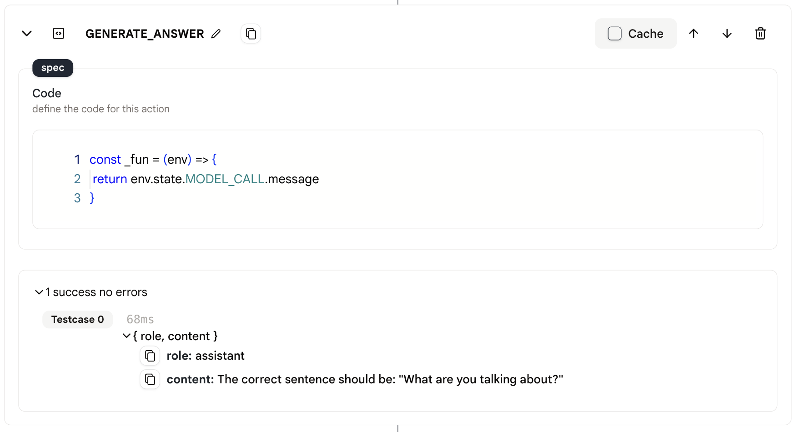
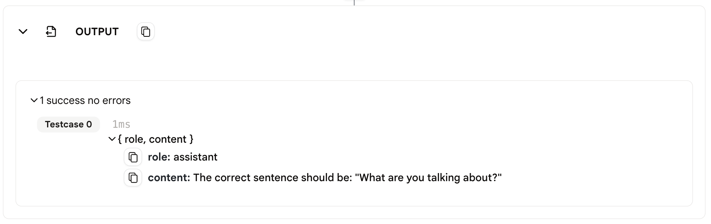

# 输出

* `输出`操作用于向代理发送输出信息。

* 代理中的最后一个操作必须是`输出`操作，您不能删除或复制它。

* 输出操作之前的最后一个操作将把输出给予`输出`操作。然后`输出`操作将输出给代理的用户或调用代理的应用程序。

## 使用方法

* 您可以在`输出`操作之前插入一个`代码`操作，并指定您想要返回给用户的结果。

* 如果没有特殊设置，`输出`操作将返回最后一个操作的输出给用户。

<figure></figure>

<figure></figure>

## 数据格式

* 在代理页面中使用时，输出显示在`输出`操作下方。

* 当连接到应用程序时，输出被发送给应用程序的用户。

* 输出数据格式如下：
    
    ```json
    {
        "role": "assistant",
        "content": "内容。"
    }
    ```