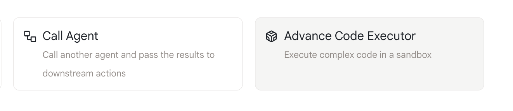
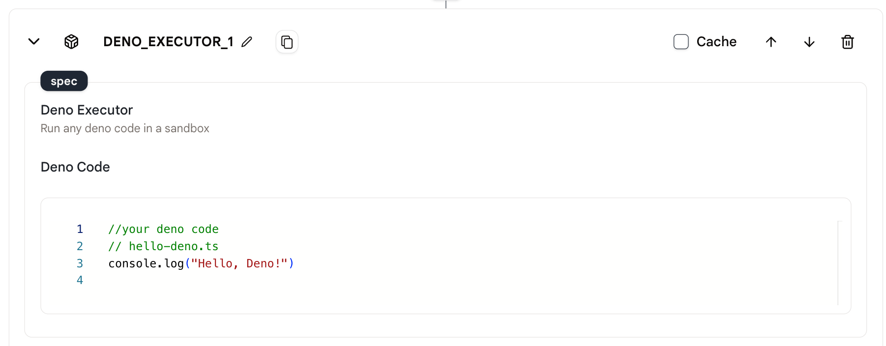
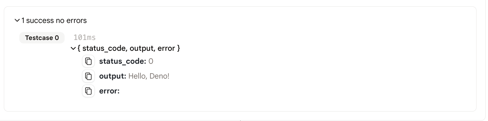

# 高级代码执行器

此动作允许您在代理中执行Deno代码。

## 使用方法

* 首先，在您的代理中创建一个"代码解释器"动作。

<figure></figure>

* 然后，您可以在动作的编辑器中编写代码。
* 注意：在此动作中，我们只支持TypeScript和JavaScript代码。

<figure></figure>

* 最后，运行代理并查看结果。

<figure></figure>

## 输出

* 代码的输出将是一个json对象，output是代码的执行结果，如果代码成功执行，status_code为0，error字段为空。
* 如果代码执行失败，status_code将是相应的错误代码，error字段将包含错误信息。

```json
{
  "status_code":0,
  "output":"Hello, Deno!",
  "error:""
}

```json
{
  "status_code":0,
  "output":"Hello, Deno!",
  "error:""
}
```

## 示例代理

[这里](https://rebyte.ai/p/21b2295005587a5375d8/callable/2f9c66ce2d576e5dc181/editor)是一个使用"Deno代码执行器"动作的简单示例代理。

