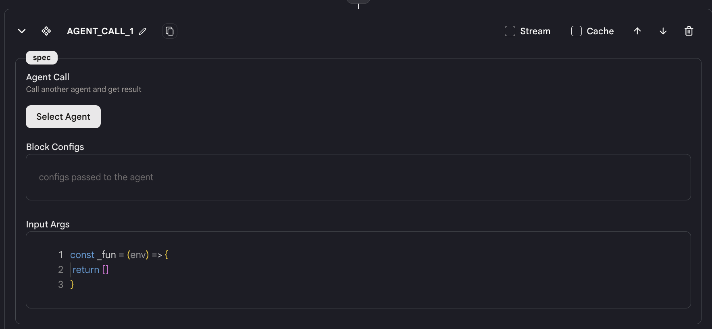
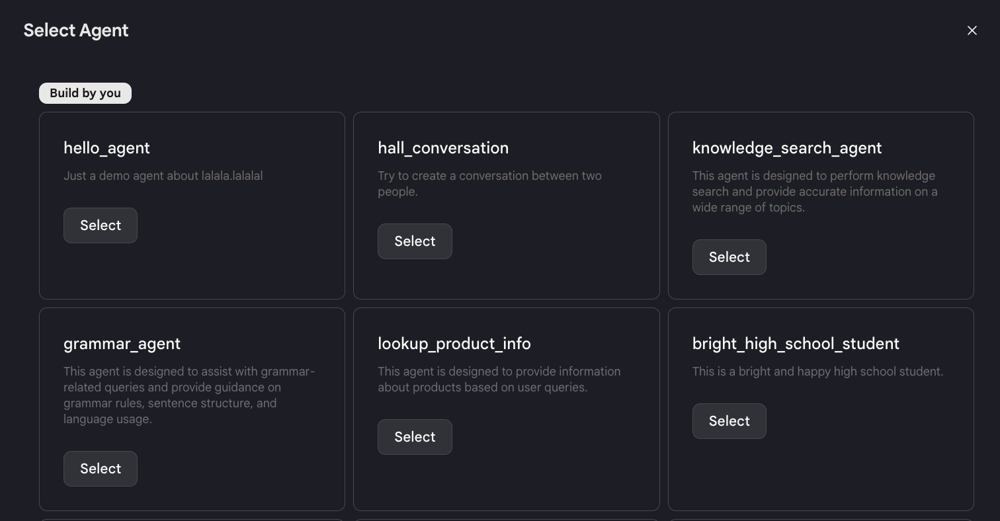
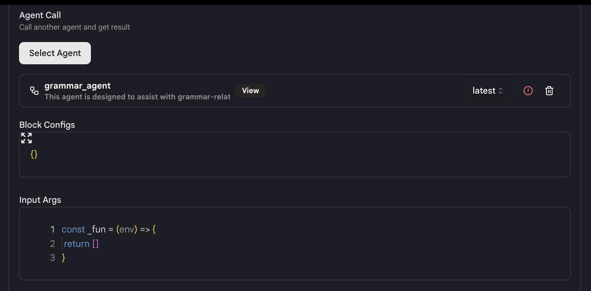
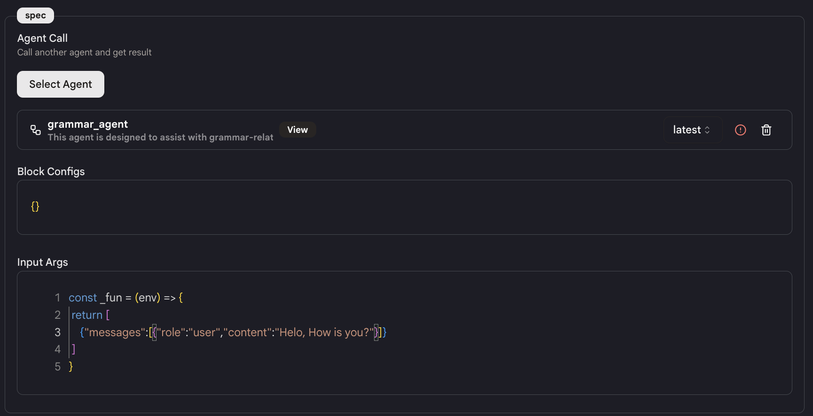
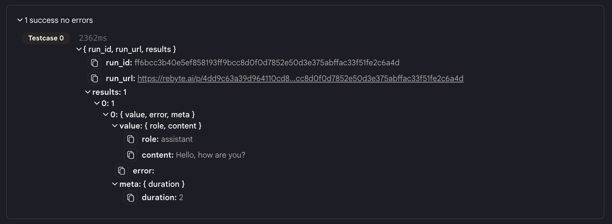

# 调用代理

我们提供了`调用代理`动作，使你能够在你的代理中将其他代理作为一个动作来调用。

## 使用方法

* 在你的代理中添加一个`调用代理`动作。

<figure></figure>

* 选择你想要调用的代理（让我们称之为**"代理B"**）并选择正确的版本。

<figure></figure>

<figure></figure>

* 填写代理B的"输入参数"；代理B的输出就是这个动作的输出。

<figure></figure>

* **注意**：在填写"输入参数"之前，请确保你完全理解代理B的输入格式。否则，系统将抛出错误。

* 使用"块配置"来配置代理B的动作。

## 输出

这个动作的输出如下：

<figure></figure>

JSON

| 参数        | 类型   | 描述                           |
|-------------|--------|--------------------------------|
| status.run  | 对象   | 调用的结果（成功或失败）       |
| results     | 对象   | 响应                           |
| others      | 对象   | 被调用代理的状态               |