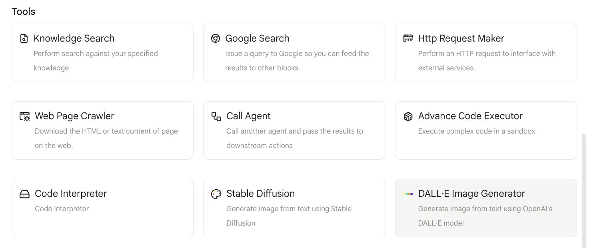
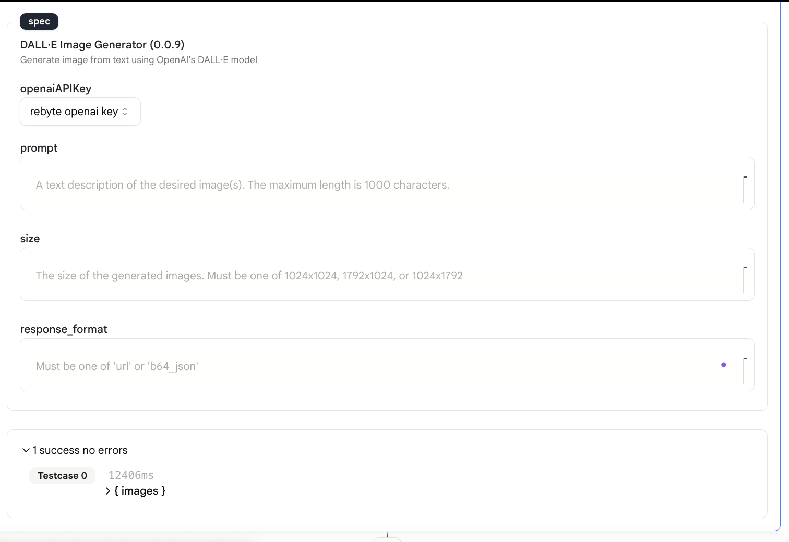
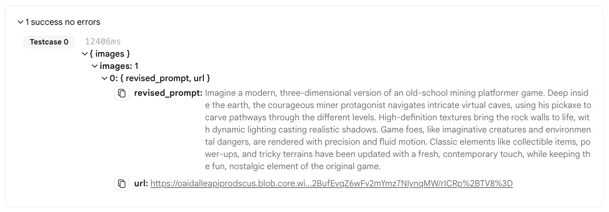

# DALL-E图像生成器

此动作允许您输入文本提示并使用[DALL-E](https://openai.com/blog/dall-e/)模型生成图像。

## 使用方法

* 首先，在您的代理中添加一个"DALL-E图像生成器"动作。

<figure></figure>

* 填写提示、图像尺寸和响应格式。
  * 提示：您想要生成的图像的详细描述。
  * 图像尺寸：您想要生成的图像的尺寸。应该是以下之一："1024x1024"、"1792x1024"、"1024x1792"。
  * 响应格式：响应的格式。应该是以下之一："url"、"base64"。
  
<figure></figure>
  
## 输出

* 此动作的输出是一个URL或base64编码的图像。

<figure></figure>

* 点击链接，您就能看到生成的图像！

<figure></figure>

* 您可以使用`env.state.REBYTE_OPENAI_IMAGE_GEN_1.images[0].url`或`{{REBYTE_OPENAI_IMAGE_GEN_1.images[0].url}}`在下一个动作中引用URL。
  
* base64编码的图像可以使用`env.state.REBYTE_OPENAI_IMAGE_GEN_1.images[0].base64`或`{{REBYTE_OPENAI_IMAGE_GEN_1.images[0].base64}}`来引用。