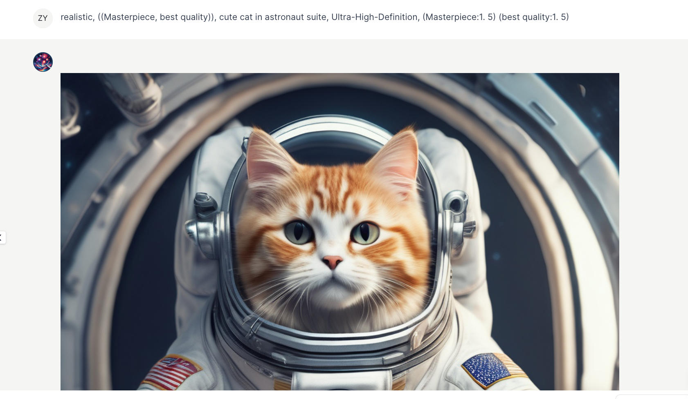
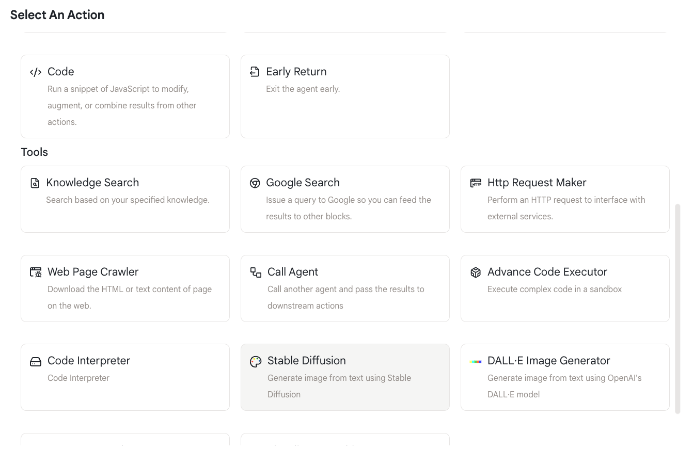
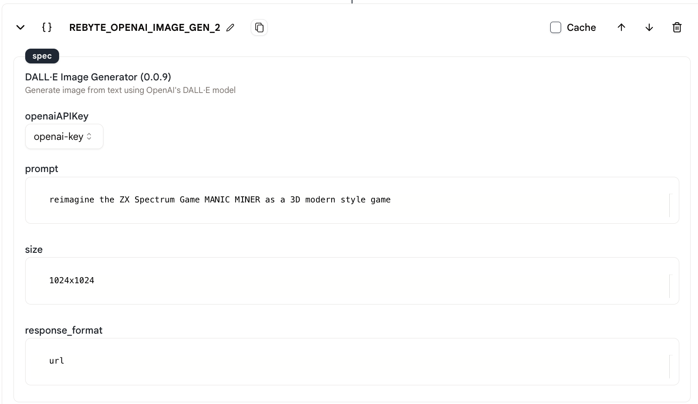
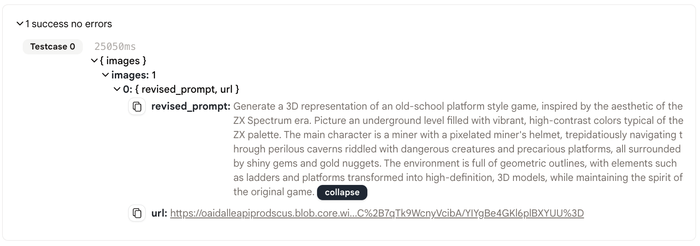

# Stable Diffusion

此动作允许您输入文本提示并使用Stable Diffusion模型生成图像。

<figure></figure>

## 使用方法

* 首先，在您的代理中添加一个"Stable Diffusion"动作。

<figure></figure>

* 填写提示、图像尺寸和响应格式。
  * 提示：您想要生成的图像的详细描述。
  * 图像尺寸：您想要生成的图像的尺寸。应该是以下之一："1024x1024"、"1792x1024"、"1024x1792"。
  * 响应格式：响应的格式。应该是以下之一："url"、"b64_json"。
  
<figure></figure>
  
## 输出

* 此动作的输出是一个URL或base64编码的图像。

<figure></figure>

* 点击链接，您就能看到生成的图像！

<figure></figure>

* 您可以使用`env.state.REBYTE_OPENAI_IMAGE_GEN_1.images[0].url`或`{{REBYTE_OPENAI_IMAGE_GEN_1.images[0].url}}`在下一个动作中引用URL。
  
* base64编码的图像可以使用`env.state.REBYTE_OPENAI_IMAGE_GEN_1.images[0].base64`或`{{REBYTE_OPENAI_IMAGE_GEN_1.images[0].base64}}`来引用。

## 示例代理

* [这里](https://rebyte.ai/p/21b2295005587a5375d8/callable/3396e0e83a81396c1ba7/editor)是Stable Diffusion动作的"使用方法"代理。

* [这里](https://rebyte.ai/copilot/c359f8a71fa2e7c6264a/session/d67c8195be)是Stable Diffusion的应用程序。