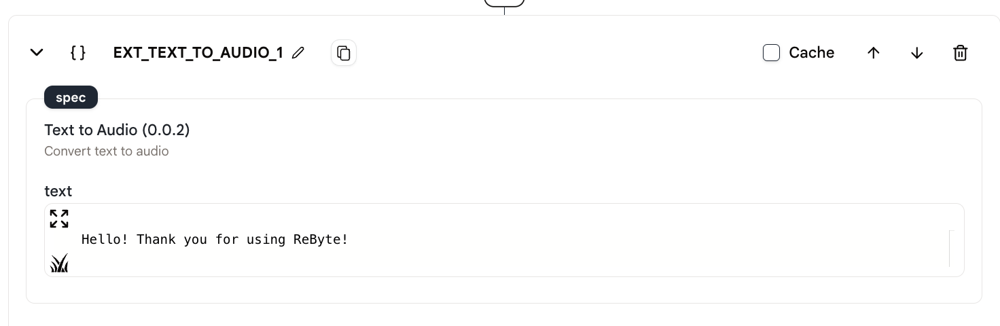
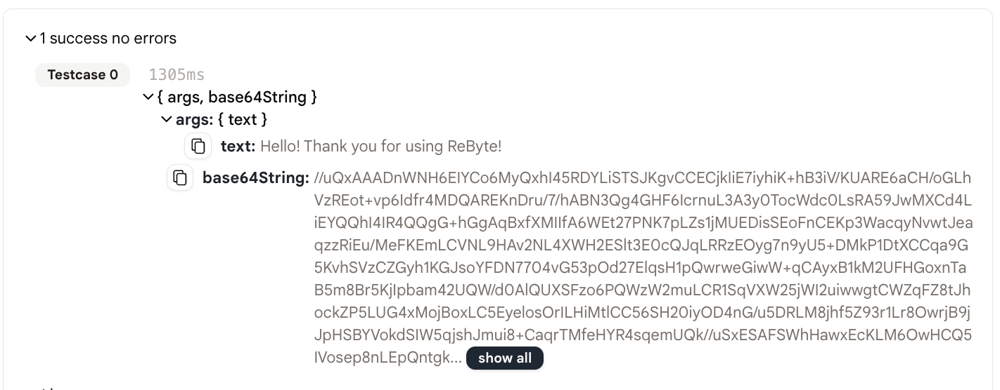

# 文本转语音

此动作允许您将文本转换为base64格式的音频。

## 使用方法

* 首先，在您的代理中创建一个"文本转语音"动作。

<figure></figure>

* 然后，在动作的编辑器中写入您想要转换为音频的文本。

<figure></figure>

* 最后，运行代理并查看base64音频结果。

<figure></figure>

## 输出

输出是一个包含两个字段的对象："args"和"base64String"。"args"字段包含输入文本，"base64String"字段包含base64音频字符串。

```json
{
  "args": {
    "text": "你好！感谢使用ReByte！"
  },
  "base64String": "//UklGRiQAAABXQVZFZm10IBAAAAABAAEAgD4AAAB9AAACABAAZGF0YQAAAAAA..."
}
```

## 示例代理

[这里](https://rebyte.ai/p/21b2295005587a5375d8/callable/30fb713f62a5a2b562a3/editor#1)是一个使用"文本转语音"动作的简单示例代理。