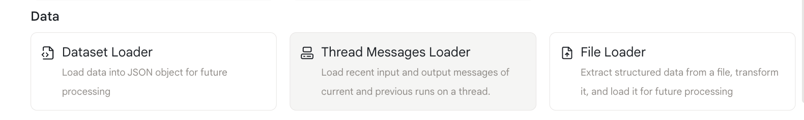
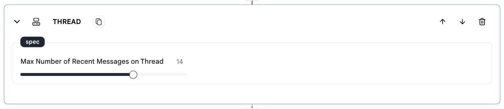
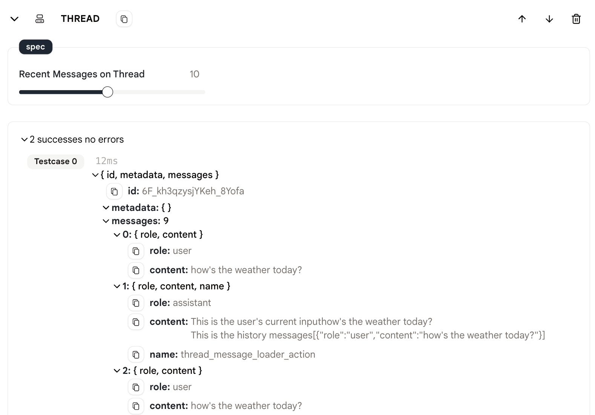

# 线程消息加载器

此动作允许您在代理中加载线程的历史消息。

## 使用方法

* 首先在您的代理中添加一个`线程消息加载器`动作。

<figure>
  
</figure>

* 设置"线程上的最近消息"来指定您想要加载的最近消息数量。

<figure>
  
</figure>

* 在后续动作中使用加载的消息来为对话添加上下文。

* 运行代理并查看从线程加载的消息。

<figure>
  
</figure>

## 示例代理

[这里](https://rebyte.ai/p/21b2295005587a5375d8/callable/c6b378f9c462ebbe60a8/editor)是一个示例代理，向您展示如何使用`线程消息加载器`动作。