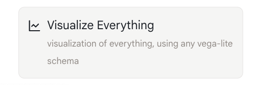
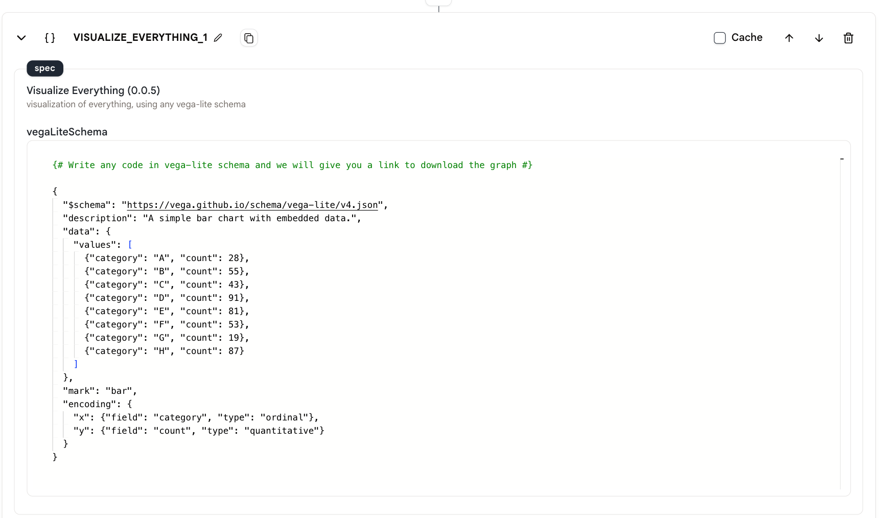
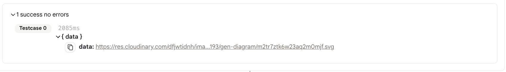
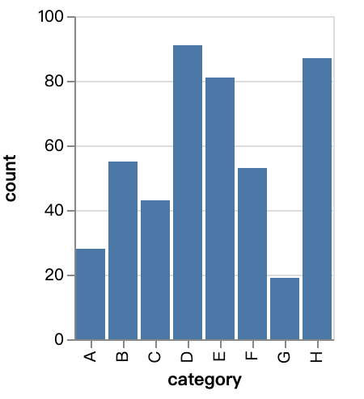

# 可视化一切

此动作允许您编写vega-lite代码来可视化您的数据。您可以使用此动作创建各种可视化，包括条形图、折线图、散点图等。

## 使用方法

* 首先，在您的代理中添加一个`可视化一切`动作。

<figure>
   
</figure>

* 在`spec`字段中编写您的vega-lite代码。

<figure>
   
</figure>

* 运行代理，我们将为您提供一个下载可视化的链接。

<figure>
   
</figure>

* 这是代码和svg文件的示例。

```
{# 用vega-lite模式编写何代码，我们将给您一个下载图表的链接 #}

{
  "$schema": "https://vega.github.io/schema/vega-lite/v4.json",
  "description": "一个带有嵌入数据的简单条形图。",
  "data": {
    "values": [
      {"category": "A", "count": 28},
      {"category": "B", "count": 55},
      {"category": "C", "count": 43},
      {"category": "D", "count": 91},
      {"category": "E", "count": 81},
      {"category": "F", "count": 53},
      {"category": "G", "count": 19},
      {"category": "H", "count": 87}
    ]
  },
  "mark": "bar",
  "encoding": {
    "x": {"field": "category", "type": "ordinal"},
    "y": {"field": "count", "type": "quantitative"}
  }
}
```

<figure>
   
</figure>

## 示例代理

[这里](https://rebyte.ai/p/21b2295005587a5375d8/callable/2852459e7cc4370f1b50/editor)是一个演示代理，向您展示如何使用`可视化一切`动作。
