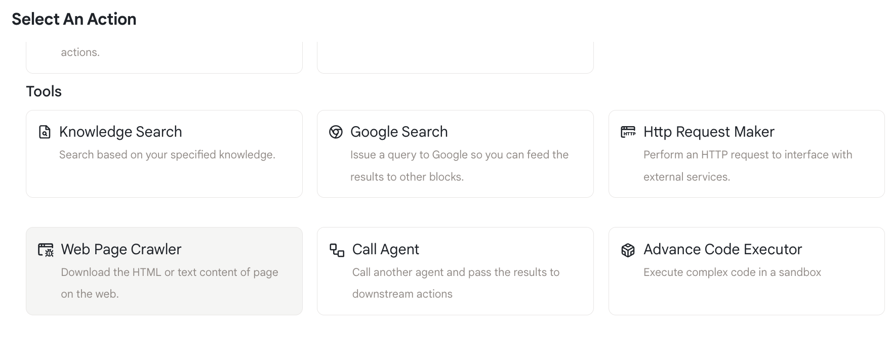
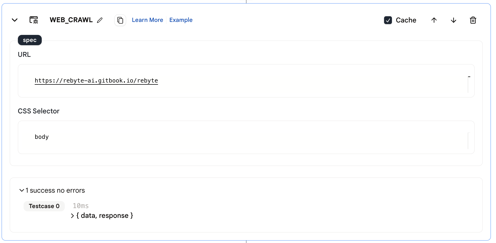
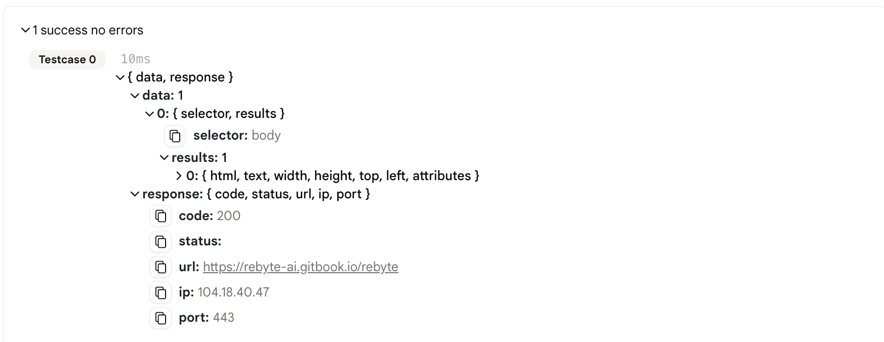

# 网页爬虫

这个动作帮助你从特定网页获取 HTML 内容。

## 使用方法

* 首先，使用代理编辑器中的 **+** 按钮向你的代理添加一个网页爬取动作。

<figure></figure>

* 指定你想要爬取的 URL 和你想用来从页面获取内容的 CSS 选择器。

**参数：**
* URL：你想要获取数据的 URL
* CSS 选择器：我们将只获取使用你指定的 CSS 选择器的内容

<figure></figure>

* 运行代理，你将在动作的输出中看到结果。

## 输出

* 输出是一个包含以下字段的 JSON 对象：
    * `data`：页面的内容
    * `response`：请求的响应对象
  
<figure></figure>

## 示例代理

* [网页爬虫](https://rebyte.ai/p/21b2295005587a5375d8/callable/35358e328e30adf8a737/editor)
