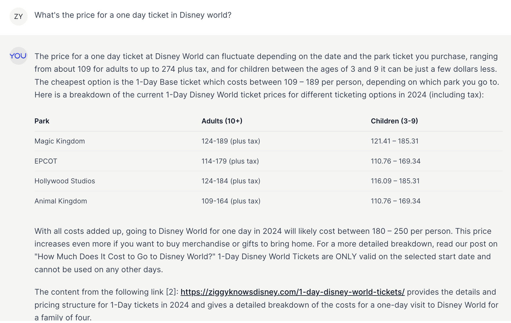
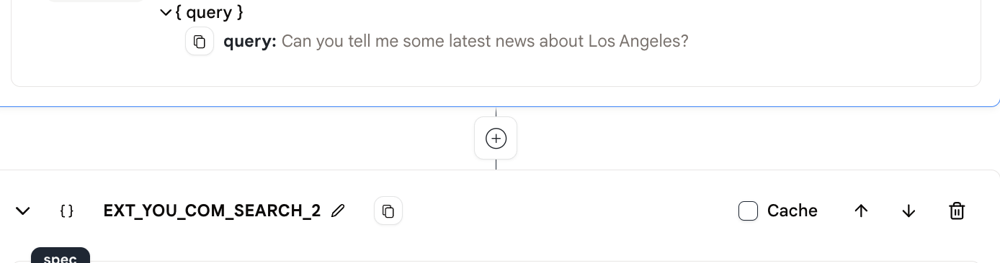
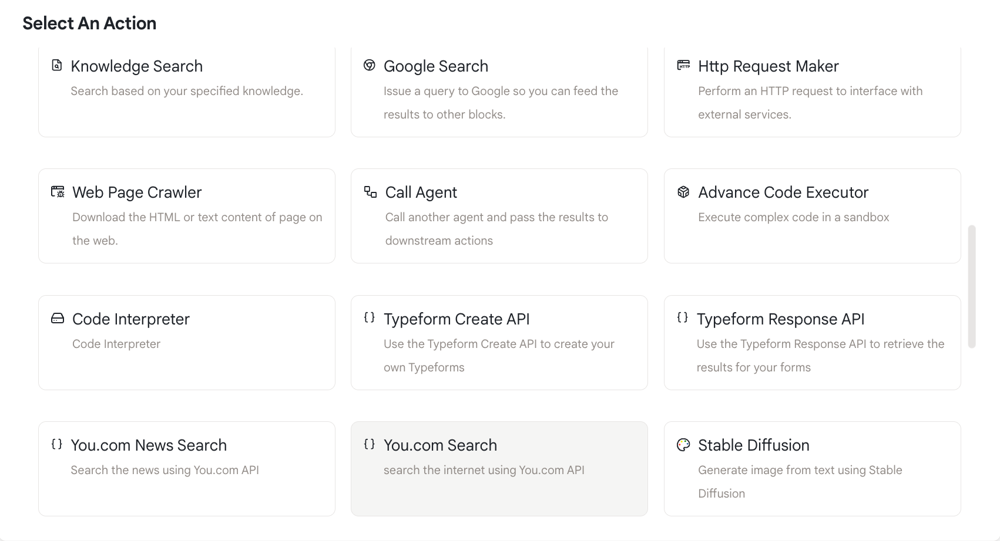
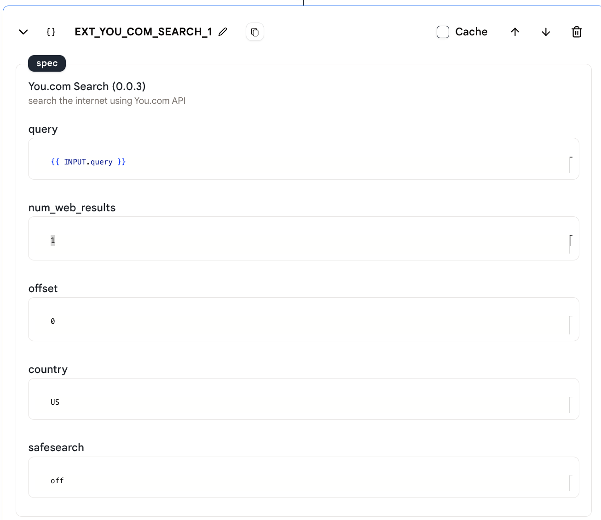
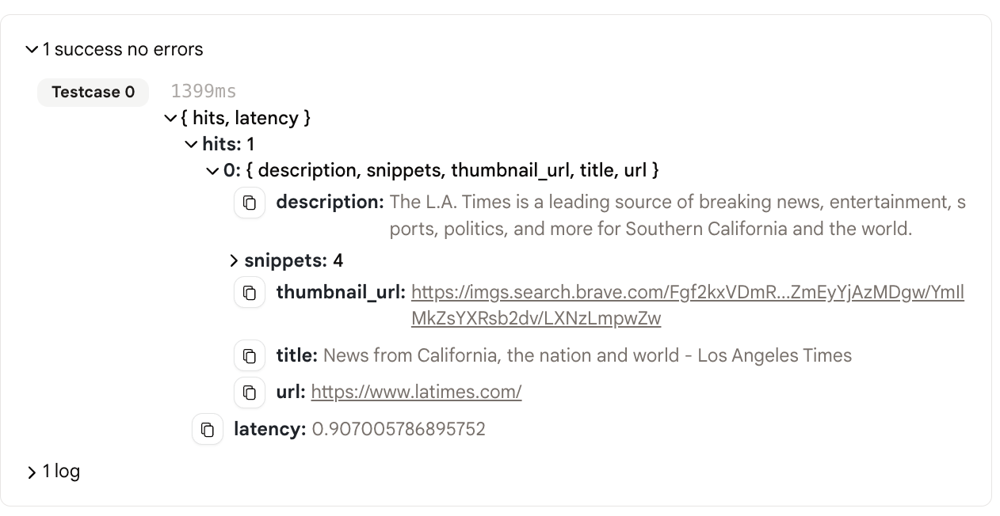

# You.com搜索

通过这个"You.com"搜索动作，您可以搜索任何内容，并在几秒钟内获得结果！

<figure></figure>

## 使用方法

* 首先通过加号添加一个"You.com"搜索动作。

<figure></figure>

* 选择"You.com搜索"动作。

<figure></figure>

* 您可以设置一些参数。
  * query：搜索查询。
  * num_web_results：您想要获取的网页结果数量。
  * offset：搜索结果的偏移量。如果偏移量为0，第一个结果将是搜索结果的第一个结果。如果偏移量为10，第一个结果将是搜索结果的第11个结果。
  * country：国家代码。例如，"US"代表美国。
    * 国家列表包括：'AR'、'AU'、'AT'、'BE'、'BR'、'CA'、'CL'、'DK'、'FI'、'FR'、'DE'、'HK'、'IN'、'ID'、'IT'、'JP'、'KR'、'MY'、'MX'、'NL'、'NZ'、'NO'、'CN'、'PL'、'PT'、'PH'、'RU'、'SA'、'ZA'、'ES'、'SE'、'CH'、'TW'、'TR'、'GB'、'US'。
  * safesearch：安全搜索模式，可以是"strict"（严格）、"moderate"（适中）或"off"（关闭）。

<figure></figure>

* 运行代理并查看搜索结果。

### 输出

<figure></figure>

* 输出比较复杂，它是一个包含两个字段的JSON对象："hits"和"latency"。

* 搜索结果在"hits"字段中，它是一个包含10个最相关搜索结果的数组。

## 示例代理

* 要查看和使用此动作，请查看示例代理：[You.com搜索](https://rebyte.ai/p/21b2295005587a5375d8/callable/b6e67fc59579d6304fef/editor)。
