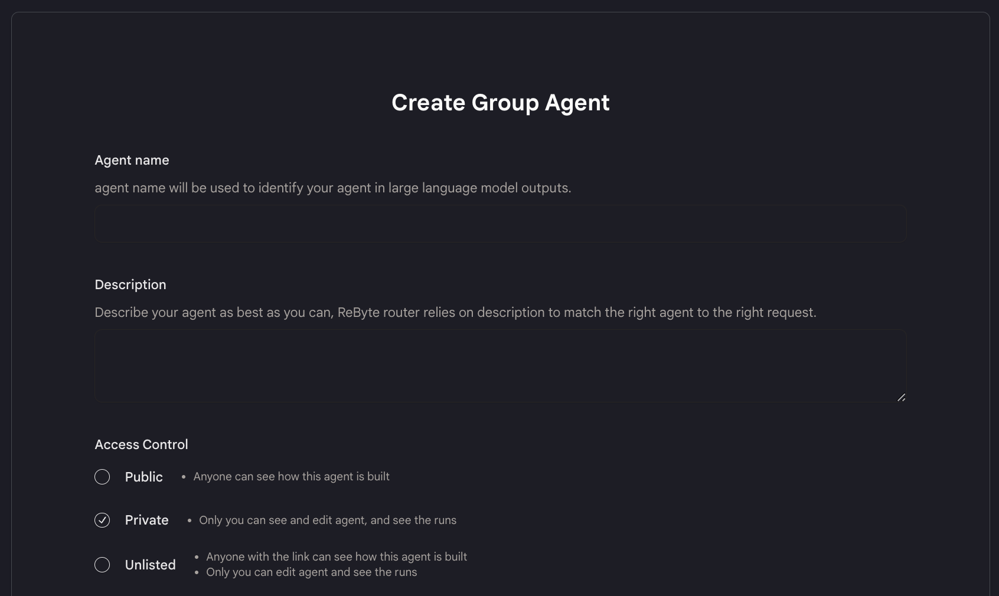
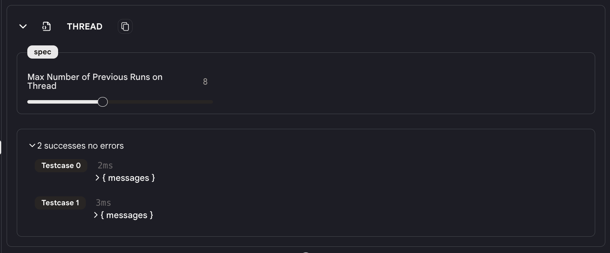
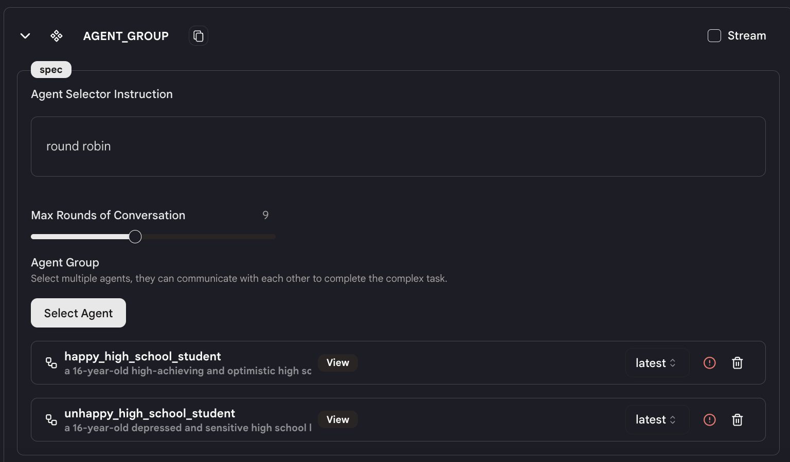

# 快速入门

在本教程中，我们将向您展示如何创建一个群组代理，让两个代理之间讨论一个话题。

## 步骤1：创建群组代理

* 在侧边栏导航到"代理"标签，然后点击右上角的"创建代理"。

* 选择"群组代理"选项。

* 填写您的群组代理的名称、描述和可见性设置。

<figure></figure>

## 步骤2：设计您的群组代理

* 这个代理只有四个动作：`输入`、`线程`、`代理组`和`输出`，您不能添加或删除任何动作。

* `输入`和`输出`动作与堆栈代理相同。您可以创建自己的数据集来测试您的代理。

**线程**

<figure></figure>

* 使用切换按钮在`线程`动作中配置"线程上的最大历史运行次数"。这是代理每次运行时将记录并发送给模型的最大历史消息数。

* 历史越长，模型可以使用的上下文就越多。但是，历史越长，代理运行的速度就越慢。
  
**代理组**

<figure></figure>

* 在`代理组`动作中选择您想要使用的代理。这里我们选择了我们创建的两个学生聊天机器人代理。

* 注意：您必须熟悉代理的功能以及代理的输入和输出格式。同时确保代理的输出格式与下一个代理的输入格式兼容。
  
* 指定群组代理中代理的执行顺序。代理将按照您指定的顺序运行代理。例如，这里我们在代理选择器指令中放入"轮流"，所以代理将在循环中一个接一个地运行代理。
  
* 按照给定的顺序，系统将一个接一个地运行代理。第一个代理的输出将是第二个代理的输入，依此类推。
  
* 您还可以设置代理之间对话的最大轮数。如果代理之间的对话超过最大轮数，代理将停止运行。

就是这样！

## 步骤3：测试您的群组代理

* 这基本上与[测试堆栈代理](../../test-your-agent/overview.md)相同。
  
* 唯一的区别是，您不应该只关注一个代理的输出，而应该仔细查看群组代理中所有代理的输出，并尝试找出它们的行为是否符合您的预期。

