# 代理创建示例

代理创建在"设计"界面中进行。以下是该界面的截图：

<figure>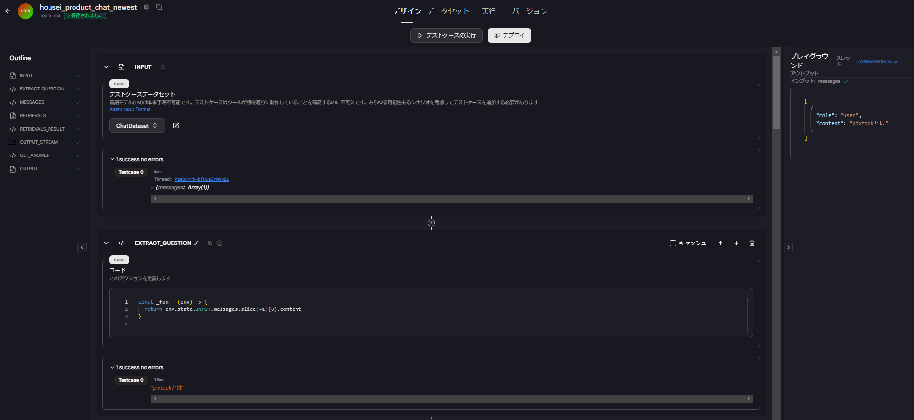</figure>

这个代理由8个模块组成：`INPUT`、`EXTRACT_QUESTION`、`MESSAGES`、`RETRIEVALS`、`RETRIEVALS＿RESULT`、`OUTPUT_STREAM`、`GET_ANSWER`和`OUTPUT`。

- `INPUT`是创建代理时必需的，在这里它将用户的问题转换为JSON格式。

<figure>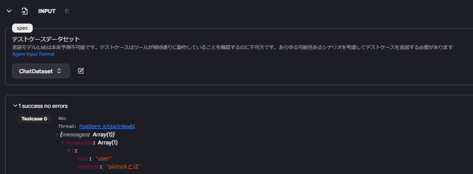</figure>

- `EXTRACT_QUESTION`使用`Code`操作来获取`INPUT`的content。

<figure>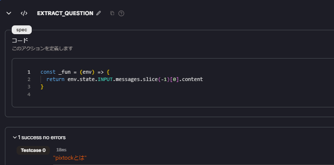</figure>

- `MESSAGES`使用`Code`操作来映射`INPUT`的messages，返回role和content。

<figure>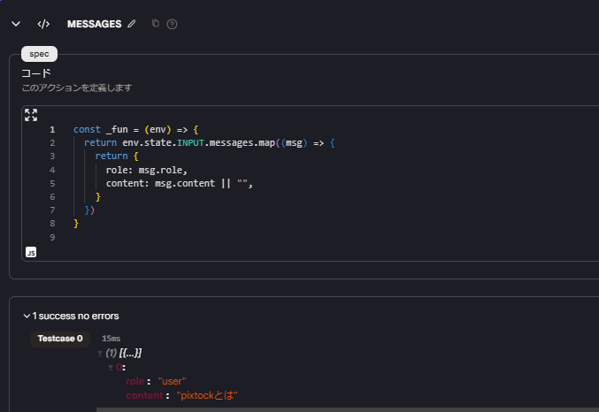</figure>

- `RETRIEVALS`使用`Knowledge Search`操作来搜索知识数据库。这里使用`EXTRACT_QUESTION`作为查询。

<figure>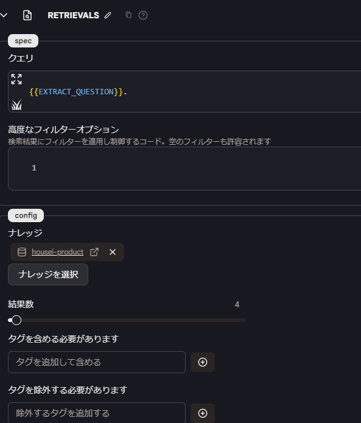</figure>

在这部分会添加元数据，下游操作可以使用这些元数据。

<figure>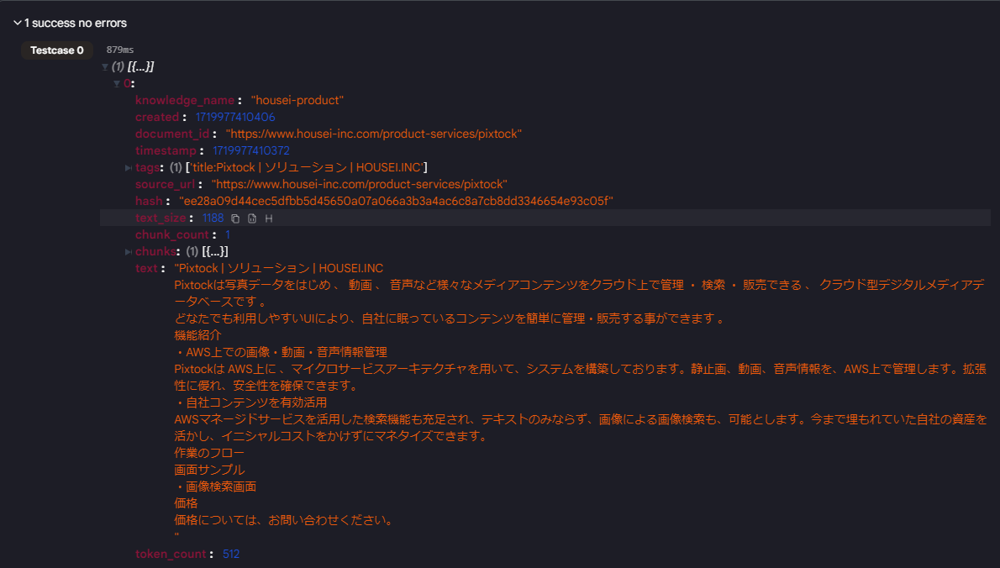</figure>

- `RETRIEVALS＿RESULT`使用`Code`操作来获取`RETRIEVALS`的document_id和chunk.text，并进行格式化后返回。使用document_id可以显示参考来源。

<figure>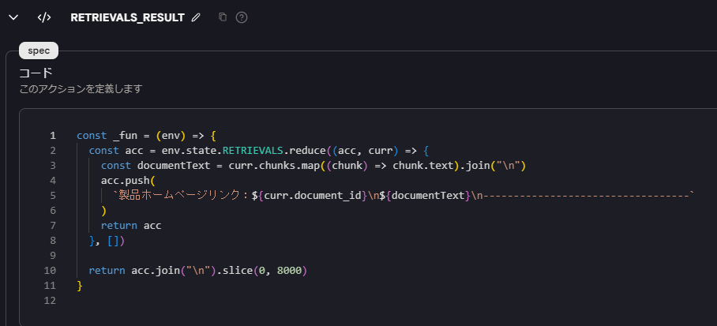</figure>

<figure>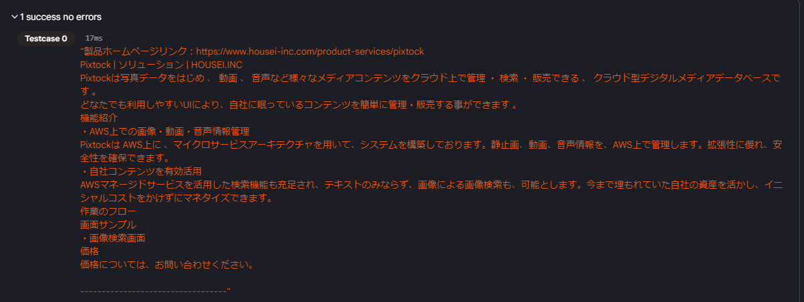</figure>

- `OUTPUT_STREAM`使用`Language Model Chat Interface`操作。这里基于`RETRIEVALS＿RESULT`的信息给模型发出指令（提示），将这个提示作为system的content，将回答作为assistant的content添加到`INPUT`中。

<figure>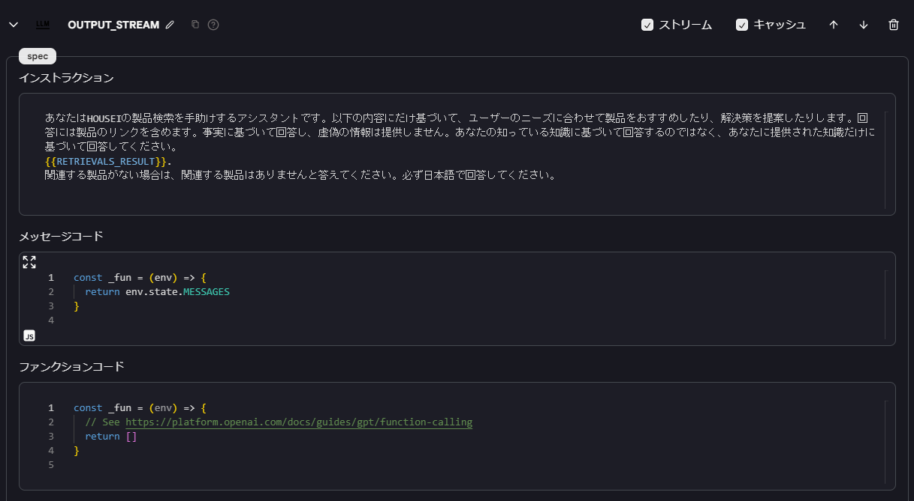</figure>

<figure>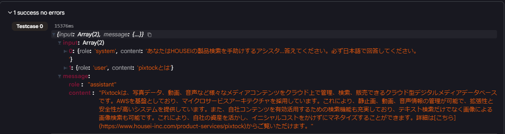</figure>

- `GET_ANSWER`使用`Code`操作来返回`OUTPUT_STREAM`中role为assistant的content。

<figure>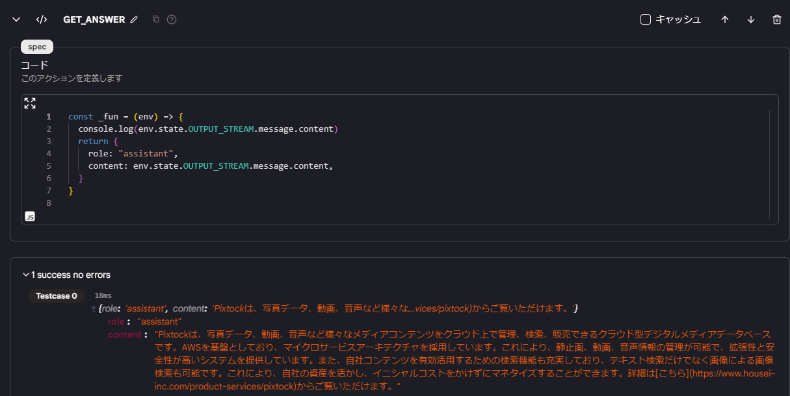</figure>

- `OUTPUT`是必需的，它接收`GET_ANSWER`的内容。

<figure>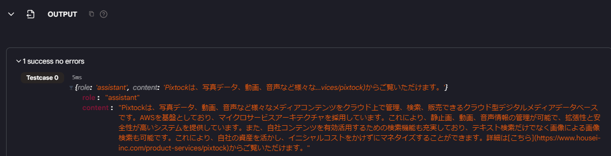</figure>

最终，`OUTPUT`的content将作为对用户的回答。