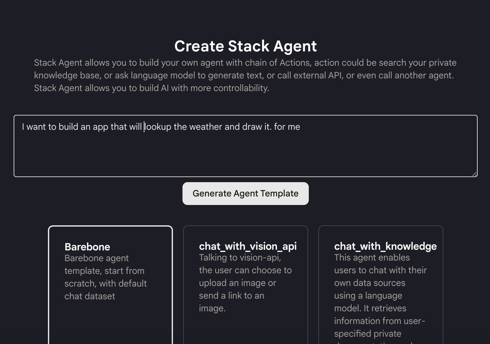
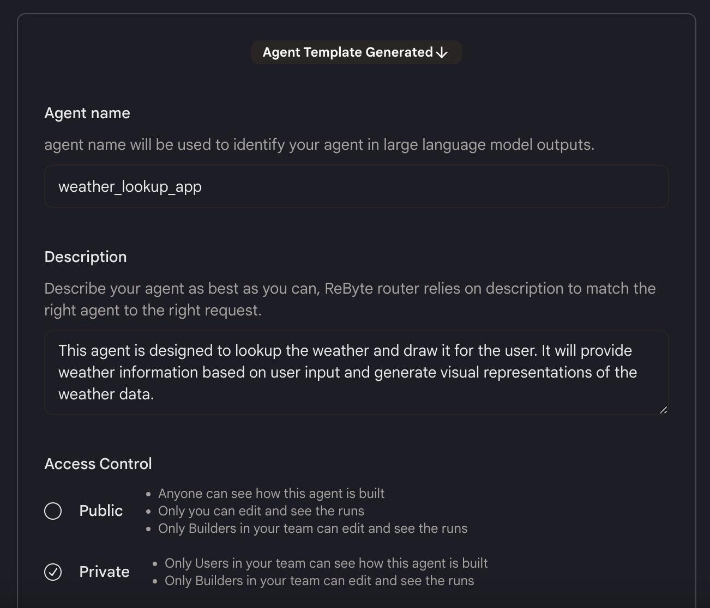
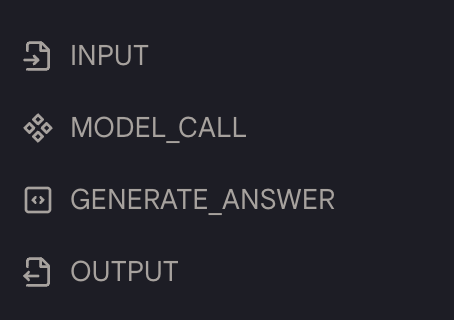
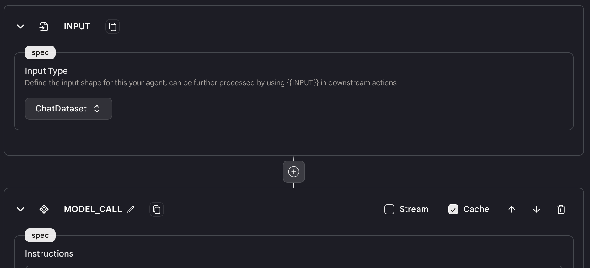
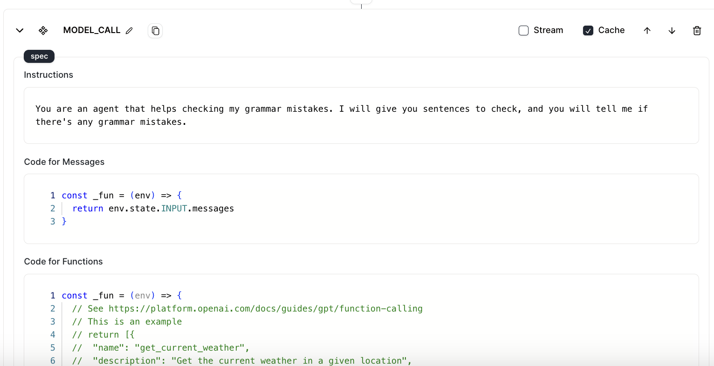
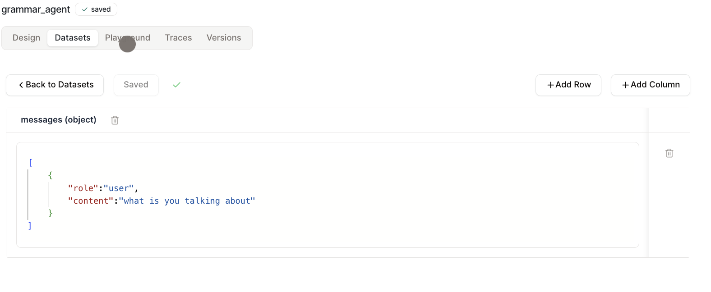
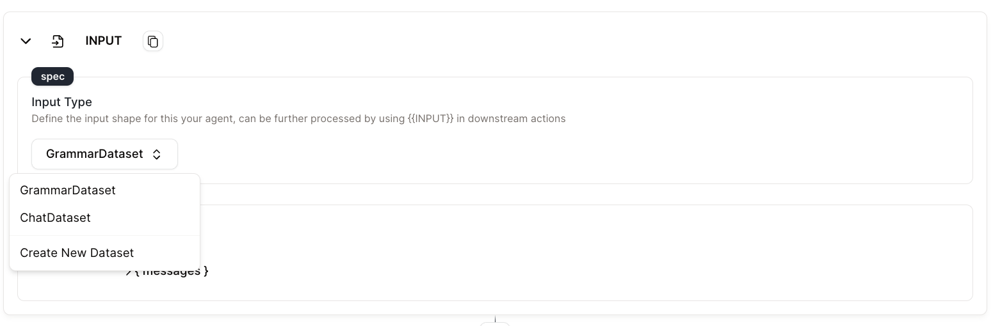
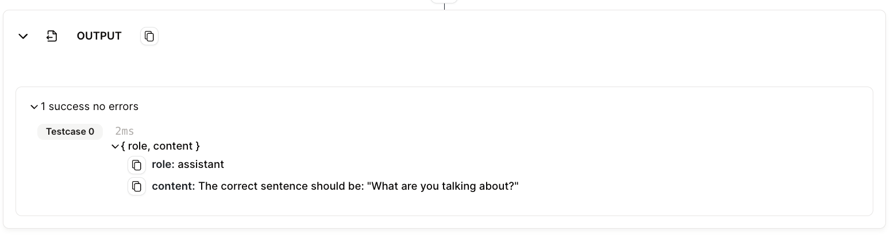
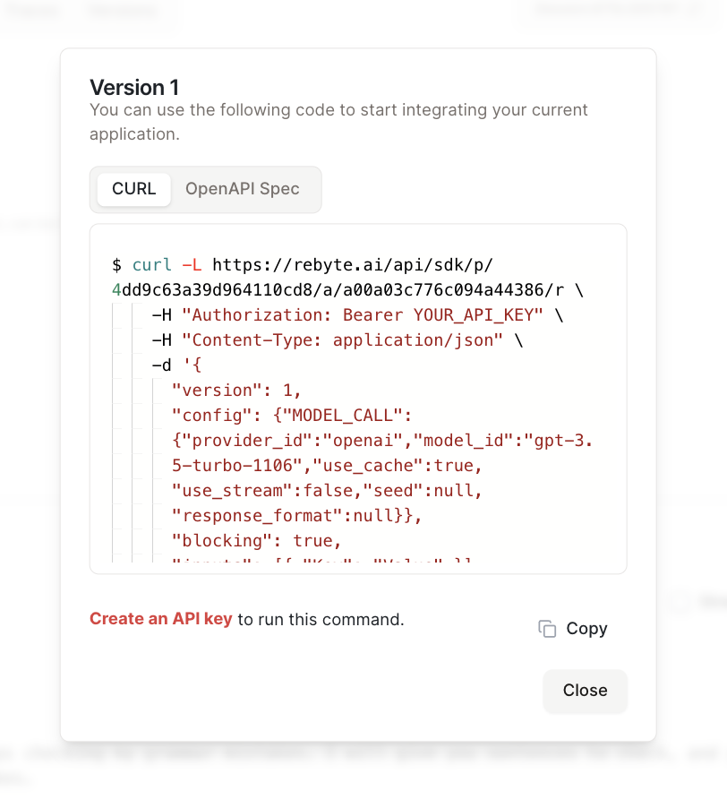
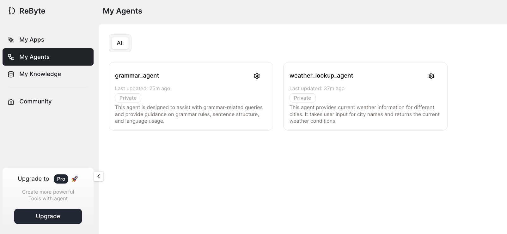

# 快速入门

我们将向您展示如何在10分钟内构建一个天气代理。

## 步骤1：创建代理

* 在侧边栏导航到"我的代理"标签，然后点击"创建代理"。

* 描述您想要用这个代理做什么，并为您的代理选择合适的模板。

<figure></figure>

* 点击"生成代理模板"按钮，我们将为您生成一个基础模板供您构建。

<figure></figure>

* 您可以更改代理的名称、描述和可见性，并添加标签以提供更多信息。如果您不喜欢当前的模板，也可以简单地重新生成模板。

* 点击"创建代理"，您将在几秒钟内拥有自己的代理。

## 步骤2：设计您的代理

* 在自动生成的模板中，我们已经为您创建了一些动作。

<figure></figure>

* 构建代理的过程：
  * 要从用户输入中获取位置，我们需要一个`语言模型聊天`动作。
  * 要搜索天气，可以使用`You.com`搜索引擎动作。
  * 要分析结果，我们应该使用另一个`语言模型聊天`来分析来自You.com搜索的结果并生成绘制图片的提示。
  * 要绘制图片，我们使用`Stable Diffusion`动作并返回一个base64图片。

<figure></figure>

* 在编辑器中为模型编写指令，描述您想要模型做什么。

<figure></figure>

## 步骤3：测试您的代理

* 点击顶部的"数据集"标签，然后点击"创建数据集"。

* 填写您的数据集的名称和描述。

* 由于这是一个聊天机器人，测试数据集将以表示对话的json对象（列表）的形式呈现。

<figure></figure>

* 创建数据集后，返回"设计"面板并选择新数据集作为输入。

<figure></figure>

* 点击"运行测试用例"以使用数据集测试您的代理。

* 结果将显示在每个动作下方。查看输出是否符合您的要求。如果不符合，更改代理的设置并重试。

<figure></figure>

## 步骤4：部署代理

* 点击右上角的"部署代理"，然后点击"部署新版本"。

* 您可以在ReByte应用程序上使用您的代理，或使用我们提供的代码将其集成到您自己的应用程序中。

<figure></figure>

🎉 **恭喜，您已经创建了您的第一个代理！**

在"我的代理"标签中查看您的所有代理。您也可以在这里克隆、保存或删除您的代理。

<figure></figure>

