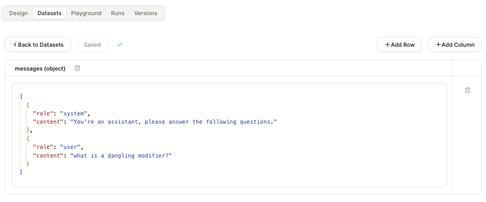

# 数据集

在设计完你的代理后，你可以使用数据集来测试它。

你可以通过"运行测试用例"来运行数据集，观察代理的响应，并根据结果进行故障排除。

## 数据集创建

* 导航到顶部的`数据集`标签。

* 点击`创建数据集`。

* 使用"添加列"来为你的数据集添加新字段。使用"添加行"来添加新的数据集项。

<figure><figcaption></figcaption></figure>

## 支持的数据类型

我们支持以下数据类型：

* 字符串
* 数字
* 布尔值
* JSON 对象

## 使用方法

数据集可以通过两种方式使用：

#### 1.为后续动作加载数据

加载的数据集可以被后续动作使用。

当数据集包含用于少量样本提示的示例数据时，这非常有用。

#### 2.确定代理的输入形状

`输入`动作的数据集决定了整个代理的输入形状。