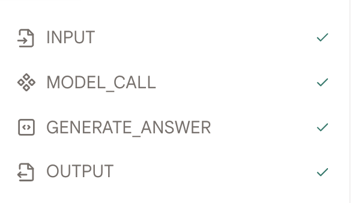
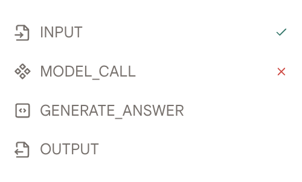
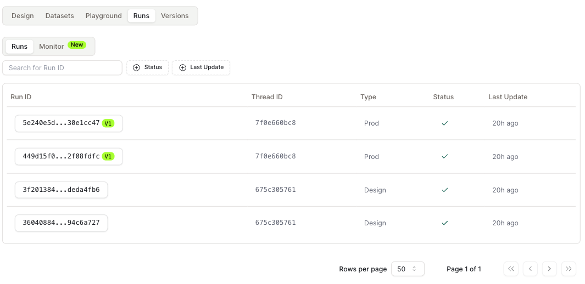
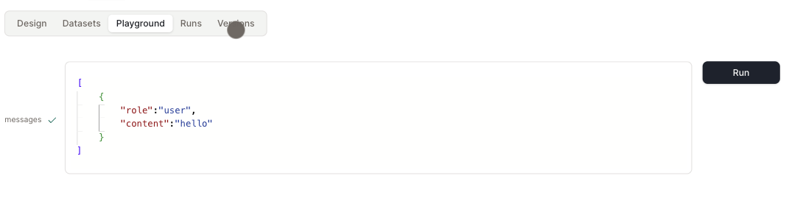

# 测试概述

在这里，我们将介绍一些基本概念，并向你展示如何测试你的代理。

## 创建测试数据集

* 数据集用于测试你的代理。你可以通过点击数据集列表页面中的"创建数据集"按钮来创建测试数据集。

## 测试和调试

* 一旦你创建了测试数据集，你可以进入"设计"页面并选择该数据集。

* 点击"运行测试用例"按钮，使用你选择的数据集运行代理。

* 运行结果将显示在每个动作下方。

* 如果运行过程中没有错误，你将在左侧看到绿色的对勾标记。

<figure></figure>

* 否则，你将在出错的动作上看到红色的叉号标记。

<figure></figure>

* 每次运行后，我们都会在"运行"标签中记录运行结果。我们提供运行ID、运行时间、运行状态以及运行中使用的代理。

* 点击每次运行的"运行ID"可以查看运行的详细信息。

<figure></figure>

## 游乐场

* 如果你希望测试更加灵活，可以使用游乐场来测试你的代理。

* 在发布之前，你应该充分利用这个功能来测试你的代理。

<figure></figure>

