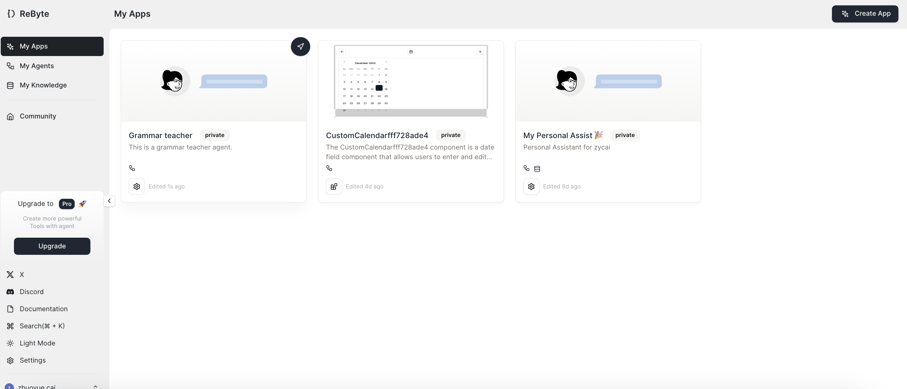
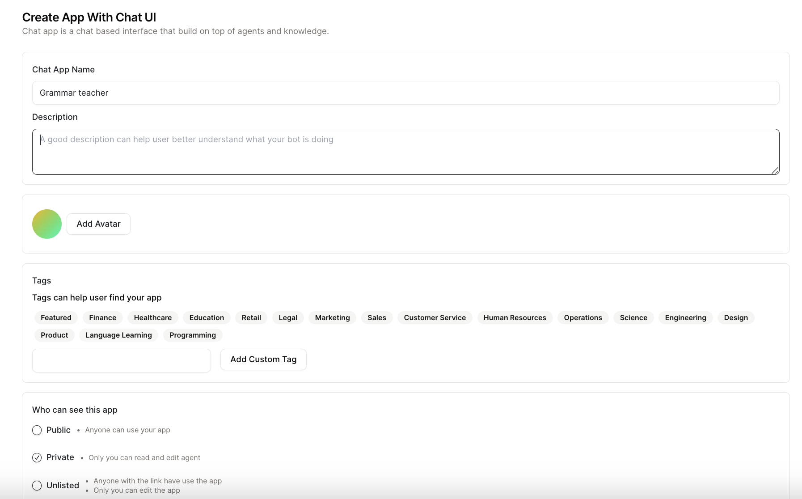
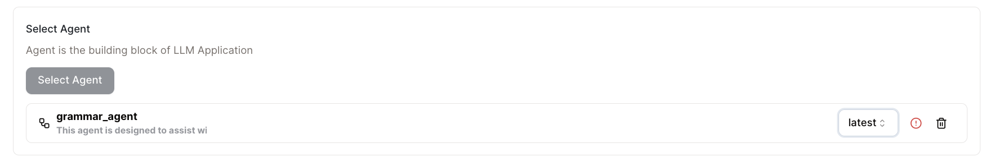
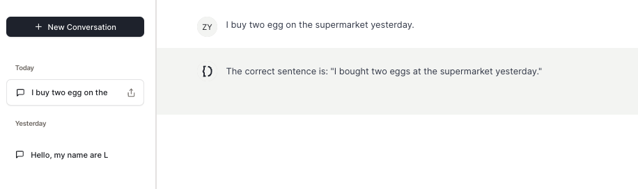

# 快速入门

我们将向您展示如何构建一个带有聊天界面的应用程序。

## 步骤1：创建应用程序

* 在侧边栏导航到"我的应用程序"标签，然后点击右上角的"创建应用程序"。选择"带聊天界面的应用程序"。

<figure></figure>

* 填写应用程序的相关信息。

<figure></figure>

* 选择您想要基于的代理，记得选择代理的版本。

<figure></figure>

* 点击"创建带聊天界面的应用程序"，就这么简单！

## 步骤2：使用您的应用程序

<figure></figure>

🎉 现在您可以在聊天界面中使用您的应用程序了！

**您可以在[这里](https://rebyte.ai/copilot/b1518cc7d7d76055f4b3/session/2d1a606382)试用这个应用程序**
