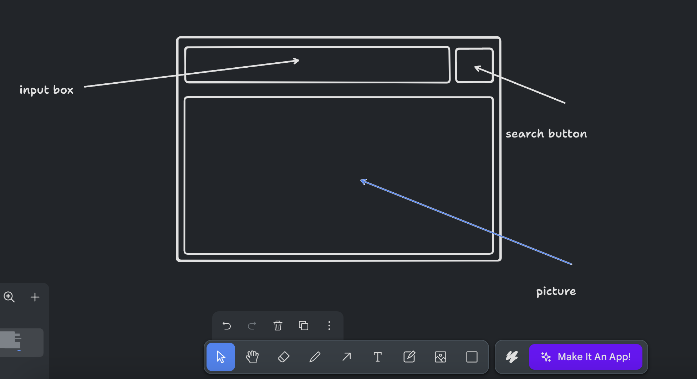
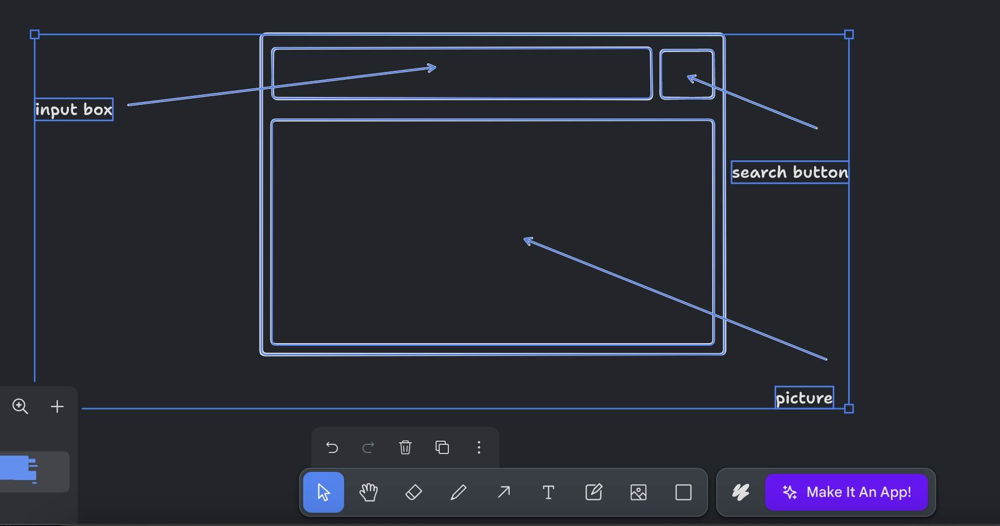
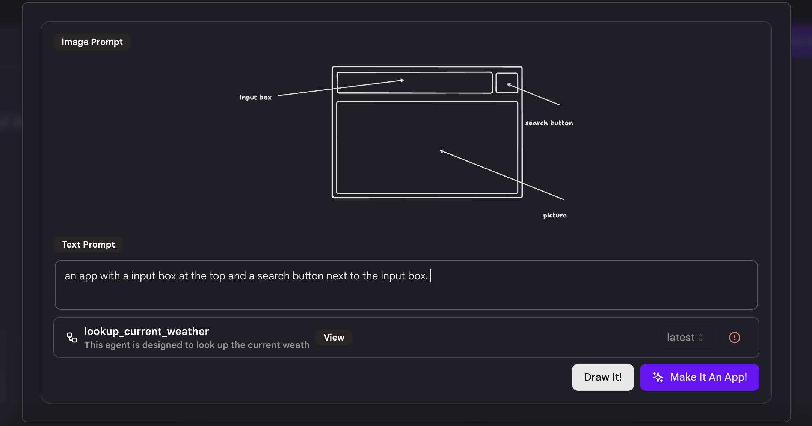
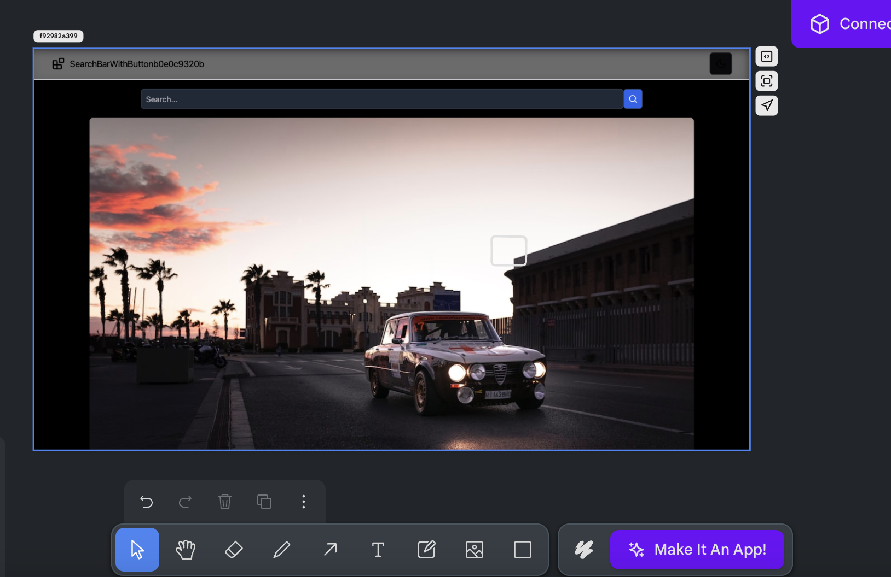
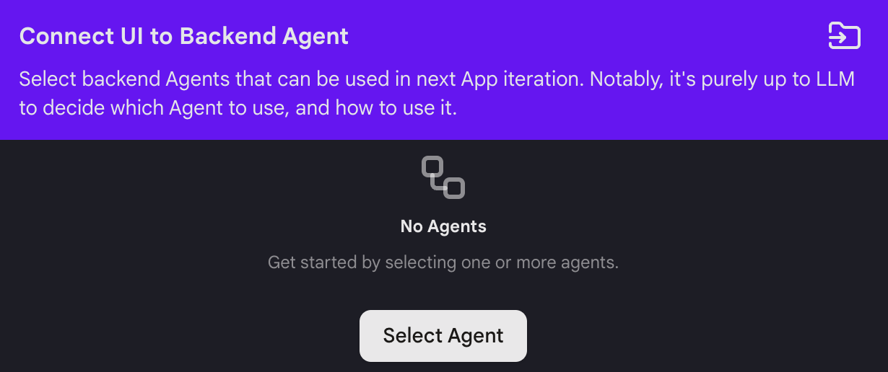
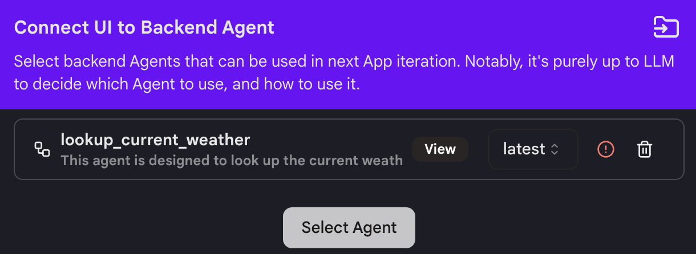
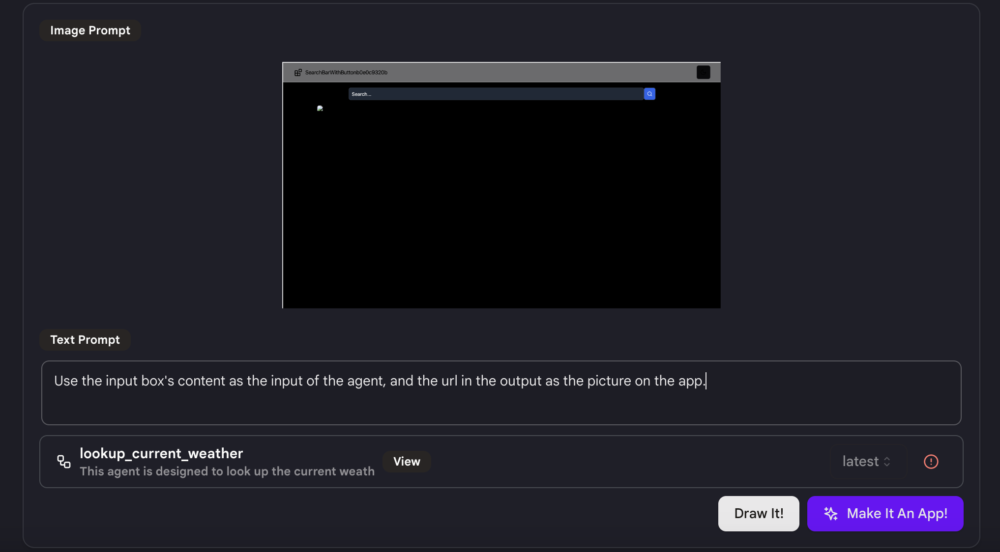

# 快速入门

我们将向您展示如何使用自定义UI构建一个简单的天气应用程序。

## 步骤1：创建应用程序

* 在侧边栏导航到"我的应用程序"标签，然后点击右上角的"创建应用程序"。

* 选择"带自定义UI的应用程序"。

* 要构建应用程序的基础版本，您可以使用"图像提示"或"文本提示"。

* "图像提示"是在画布上绘制应用程序。您可以使用底部的工具绘制应用程序界面的基本草图。

<figure></figure>
  
* 选择您画布上的绘图，完成后点击"制作成应用程序"按钮。

<figure></figure>
  
* 输入"文本提示"以使用文字进一步描述应用程序。

<figure></figure>

* 点击"制作成应用程序"按钮来构建应用程序。

## 步骤2：设计您的应用程序

* 完成第一步后，您应该能看到您的应用程序的第一个草稿。

<figure></figure>

* 您可以使用"图像提示"或"文本提示"对应用程序进行修改。这就像第一步一样。

* 要使用图像提示，使用方框、箭头和文字在画布上绘制您想要进行的更改。
  
* 要使用文本提示，点击"制作成应用程序"并输入描述您想要进行的更改的文本提示。

* 再次点击"制作成应用程序"，我们将根据您的提示为您进行更改并创建应用程序的新版本。

* **注意**：这可能不会一次就给您想要的结果。我们建议您每次尝试改进一件事，并创建更多版本，直到获得最佳结果。

## 步骤3：将您的应用程序与代理连接

* 点击右上角的"连接到代理"。

<figure></figure>

* 选择您想要连接的代理并选择版本。

<figure></figure>

* **注意**：您必须熟悉代理的功能以及代理的输入和输出格式。确保代理适合您的应用程序，否则将无法成功连接。

* 使用"图像提示"或"文本提示"来描述您想要如何在应用程序中使用代理。在这个应用程序中，输入是用户查询，如："纽约现在的天气怎么样？"。而输出是一个base64格式的图片URL。所以对于文本提示，我使用了`"使用输入框的内容作为代理的输入，并将输出中的url作为应用程序上的图片。"`

<figure></figure>

* 点击"制作成应用程序"，我们将自动将您的应用程序与所选代理连接。

* **注意**：在代理成功连接到您的应用程序之前可能需要几次尝试，请耐心等待！
  
* 一个文本提示不足以让应用程序连接到代理，所以我接着使用了`"输出图片的url是base64格式。在输入框下方显示图片。"`。经过几次尝试后，应用程序应该能正常工作。

## 提示

* 要获得更好的结果，尝试一次详细描述一个您想要进行的功能/更改。

* 充分利用绘图工具来告诉我们您想对当前应用程序进行的更改。

* 每次点击"制作成应用程序"，我们都会生成您的应用程序的新版本。如果您发现结果不满意，只需返回到之前的版本并从那里重新开始。