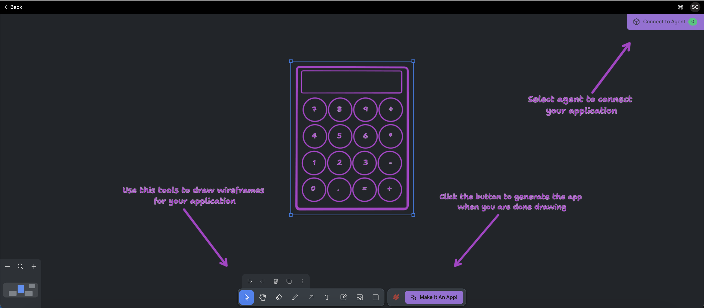
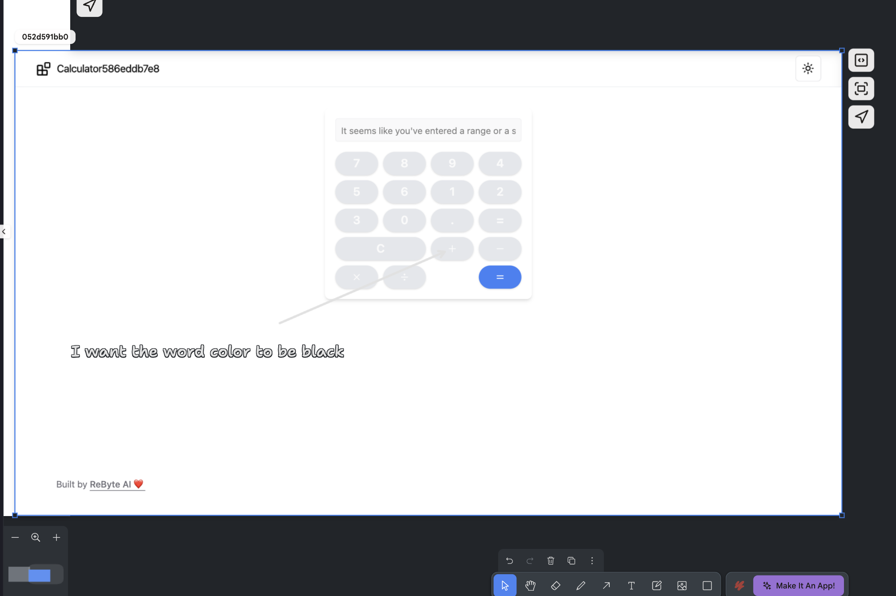
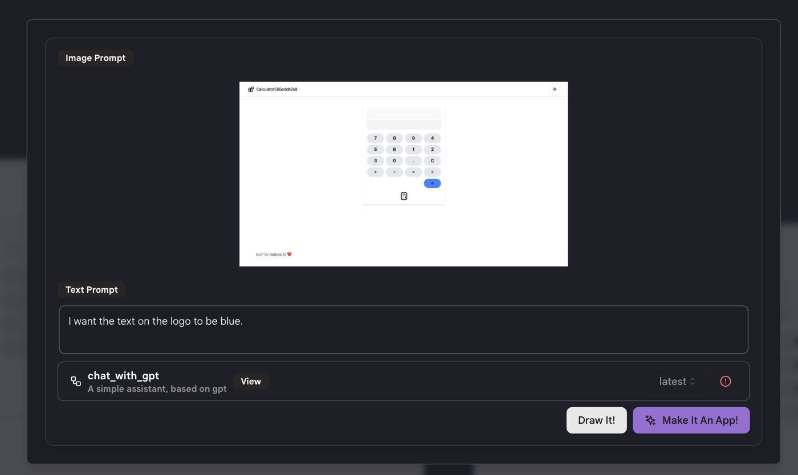
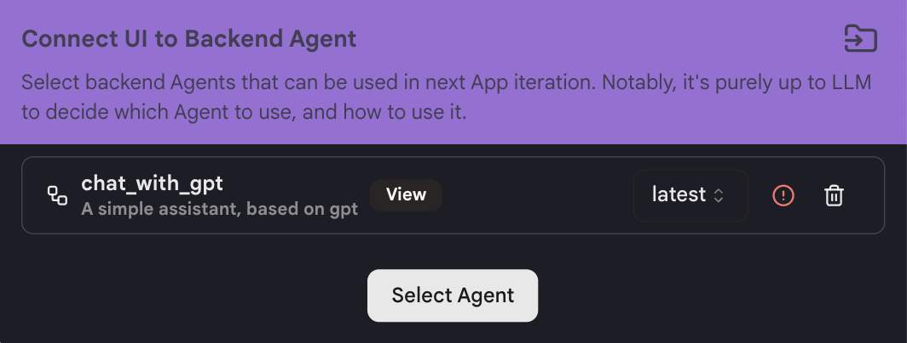
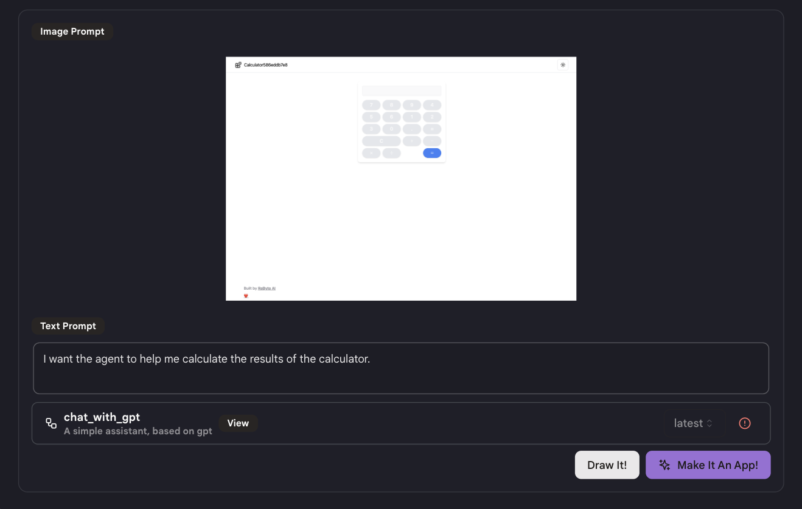

# 快速入门

我们将向您展示如何使用自定义UI构建应用程序。

## 步骤1：创建应用程序

* 在侧边栏导航到"我的应用程序"标签，然后点击右上角的"创建应用程序"。

* 选择"带自定义UI的应用程序"。

* 使用页面底部的工具绘制您的应用程序界面的基本草图。

* 点击右下角的"制作成应用程序"。

<figure></figure>

* 填写描述您想要您的应用程序做什么的文本提示。

* 然后您可以点击"绘制"或"制作成应用程序"。

## 步骤2：设计您的应用程序

如果您想对您的应用程序进行一些更改，您可以通过两种方式更改您的应用程序：

* 图像提示：在画布上绘制您想要进行的更改。

<figure></figure>

* 文本提示：点击"制作成应用程序"并输入描述您想要进行的更改的文本提示。

<figure></figure>

再次点击"制作成应用程序"，我们将根据您的提示为您进行更改并创建应用程序的新版本。

* 注意：这可能不会一次就给您想要的结果。我们建议您每次尝试改进一件事，并创建更多版本，直到获得最佳结果。

## 步骤3：将您的应用程序与代理连接

* 点击右上角的"连接到代理"并选择您想要连接的代理。

* 注意：您必须熟悉代理的功能。确保代理适合您的应用程序，否则将无法成功连接。

<figure></figure>

* 使用提示来描述您想要如何在应用程序中使用代理。

<figure></figure>

* 点击"制作成应用程序"，我们将自动将您的应用程序与所选代理连接。

## 提示

* 要获得更好的结果，尝试一次详细描述一个您想要进行的功能/更改。

* 充分利用绘图工具来告诉我们您想对当前应用程序进行的更改。

* 每次点击"制作成应用程序"，我们都会生成您的应用程序的新版本。如果您发现结果不满意，只需返回到之前的版本并从那里重新开始。