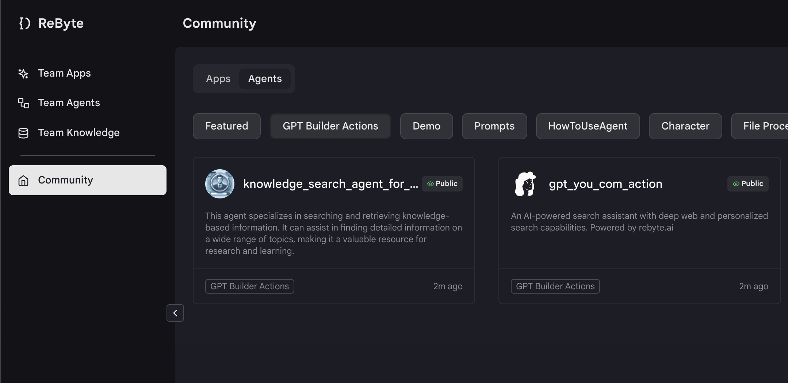

# 与Notion对话

今天我将向您展示如何使用Notion页面作为GPT的知识库。

## 步骤1：使用Notion创建知识

- 导航到知识页面并创建新的知识。

<figure></figure>

- 填写知识的名称和描述。

<figure></figure>

- 由于我们使用Notion作为知识库，我们需要选择`Notion`作为知识来源。

<figure></figure>

- 选择块大小并创建知识。

- 将您的Notion账户连接到ReByte并选择您想要使用的页面。

<figure></figure>

<figure></figure>

- 现在您应该已经有了来自Notion的内容知识。

<figure></figure>

## 步骤2：克隆代理

- 在社区中选择"GPT构建器动作"标签并点击"knowledge_search_agent_for_gpts"

<figure></figure>

- 将其复制到您自己的项目中
  
<figure></figure>

## 步骤3：选择您的知识并**部署它**

- 找到名为RETRIEVALS的动作并选择您创建的知识

<figure></figure>

- 运行测试用例并部署它

如果想了解如何设计这个代理，请参见[这里](https://rebyte-ai.gitbook.io/rbyte/apps/openai-gpts-with-ai-agent/design-your-agent)。

## 步骤4：使用ReByte API创建GPTs

- 填写您的GPTs的名称、描述和头像。

<figure></figure>

- 将您的ReByte代理相应版本的OpenAPI代码复制并粘贴到GPTs的动作中，并将**认证**设置为API密钥。

<figure></figure>

<figure></figure>

- 填写ReByte的API密钥（**选择Bearer作为认证类型**）。

<figure></figure>

- 保存并发布您的GPTs！
- 现在您可以使用它了！

<figure></figure>

<figure></figure>
