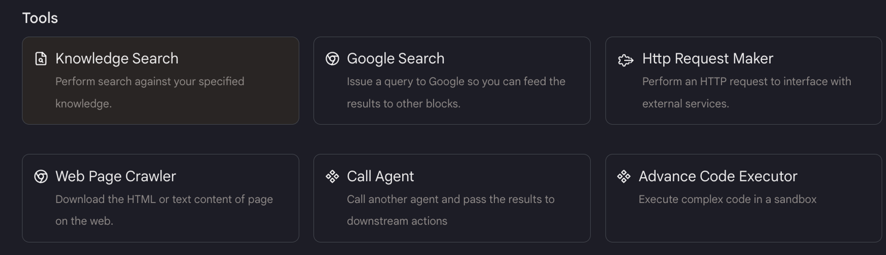
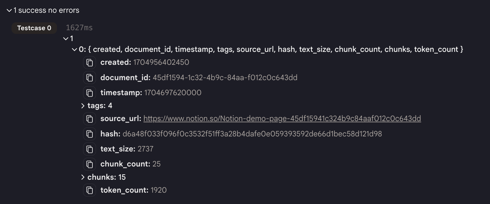
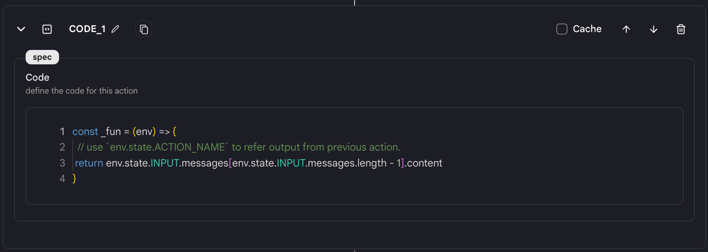
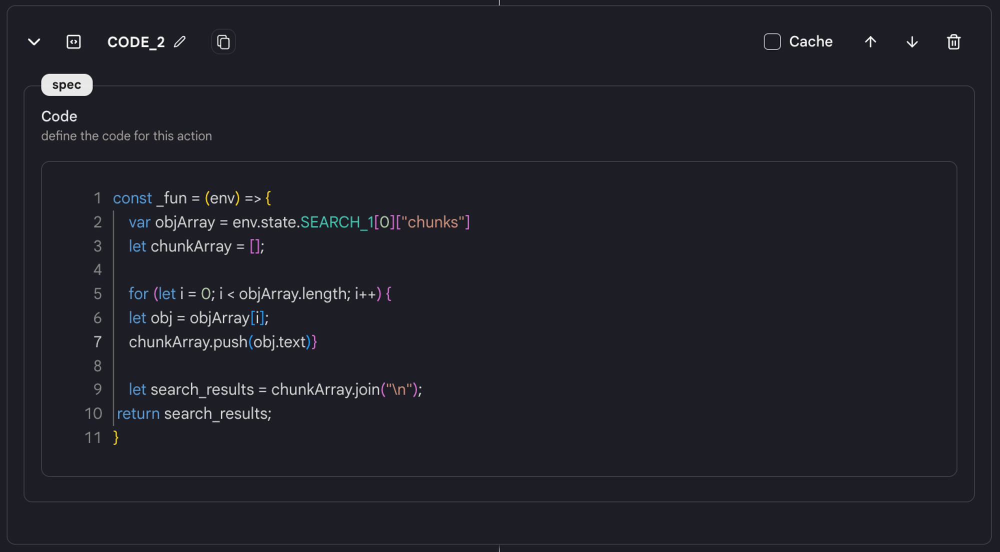
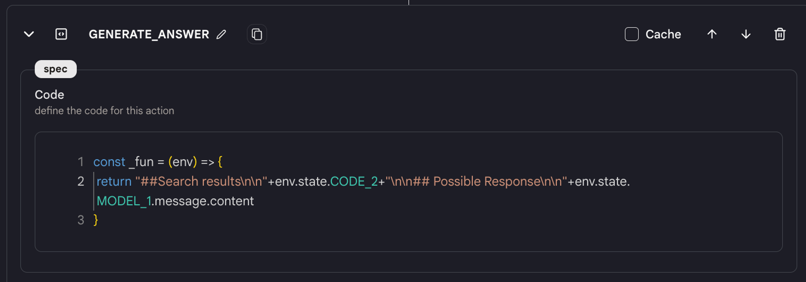
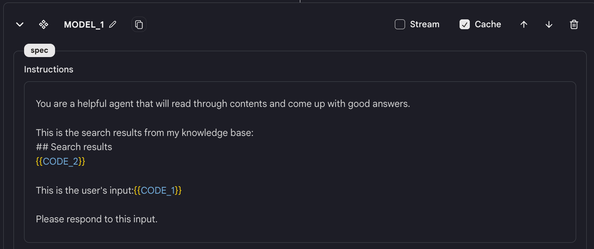

- 在自动生成的模板中，我们已经为您创建了一些动作。
- 使用不同动作之间的加号按钮添加一个"知识搜索"动作。

<figure></figure>

- 选择您刚刚创建的知识库并设置结果数量。此动作允许您在给定的知识库上执行搜索并返回结果。
- 您可以在块中看到所有的搜索结果。

<figure></figure>

- 为了更好地使用，我们在这个代理中有三个"代码"动作。
    - 第一个是从最新消息中提取内容。
        
        <figure></figure>
        
    - 第二个"代码"动作是连接"知识搜索"动作的结果。
        
        <figure></figure>
        
    - 我们使用另一个名为"生成答案"的"代码"动作来连接搜索结果和响应。
        
        <figure></figure>
        
- 现在使用"语言模型聊天界面"动作基于搜索结果获取响应。
- 在编辑器中为模型编写指令，描述您想要模型做什么。模型将为您生成响应。
<figure></figure>
