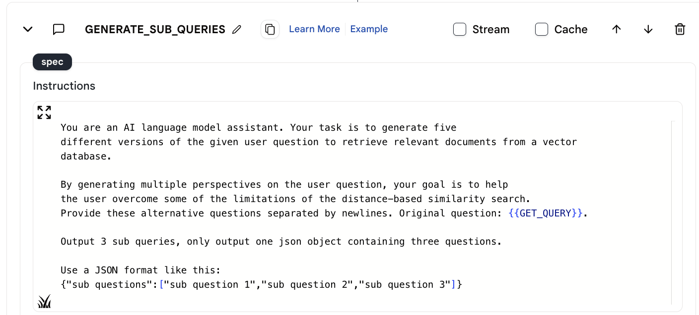
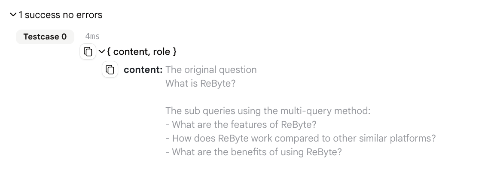
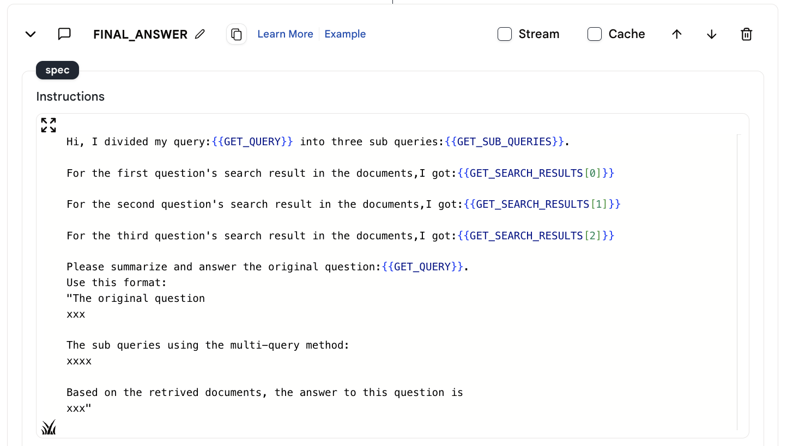
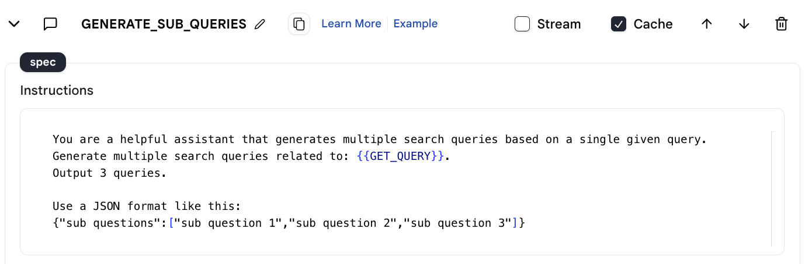
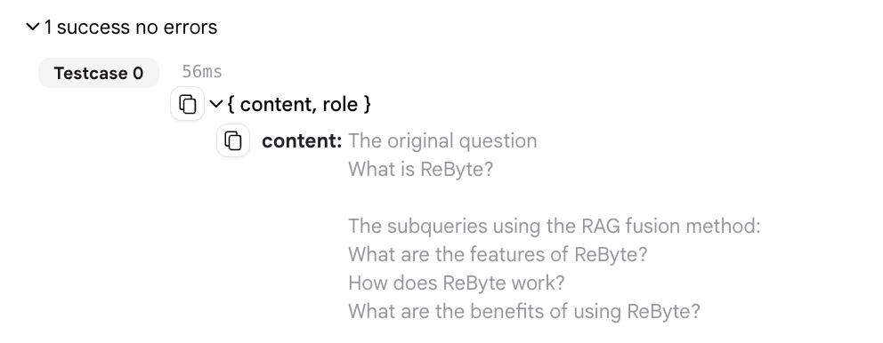
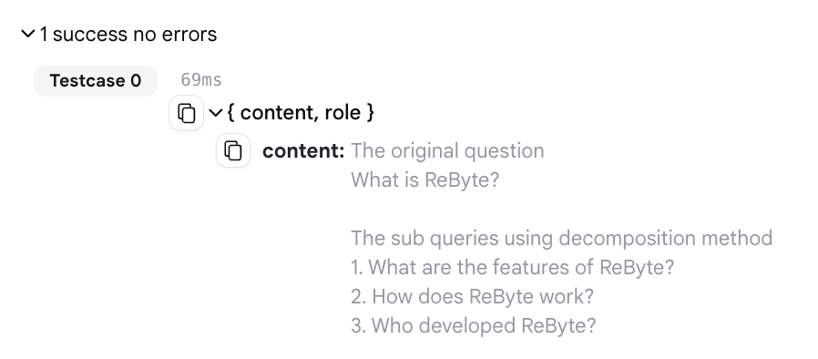
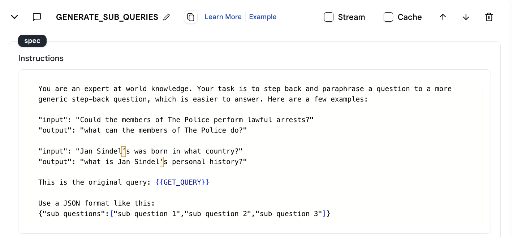
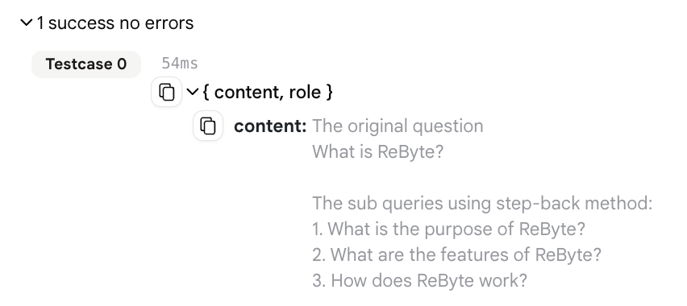

# 4个关键RAG技术指南

欢迎阅读我们关于检索增强生成(RAG)管道中查询转换技术的综合概述。在本系列中，我们探讨了四种革新用户查询处理的创新方法。这些是多查询转换、RAG融合、分解和后退提示。我们将演示如何在ReByte中实现这些技术，并提供完整的代理和应用程序示例。

## 1. 多查询转换

多查询转换通过将用户的查询重新表述为各种形式来使其多样化。在ReByte中，这是通过使用"LLM-chat"动作从单个用户问题生成多个查询来实现的。

这是LLM的提示。

<figure></figure>

LLM生成三个子查询。

<figure></figure>

这种技术提高了检索相关信息的可能性，因为每个查询版本可能与数据库中的文档有不同的匹配方式。

在实现中，我们使用"Map-Reduce"和"知识搜索"动作为每个查询检索信息，然后使用另一个"LLM-chat"动作来总结结果。

<figure></figure>

[多查询的代理演示](https://rebyte.ai/p/21b2295005587a5375d8/callable/cd26de3861da546c210f/editor)

[多查询的应用程序演示](https://rebyte.ai/copilot/55f1b8fb7803c73c88d6/session/7bca7a6793)

## 2. RAG融合

RAG融合是多查询转换的扩展，包括一个关键的倒数排名融合步骤。这种方法将多个查询的结果整合成一个优化的列表，使其非常适合全面的信息检索。

这是LLM的提示。

<figure></figure>

LLM生成三个子查询。

<figure></figure>

RAG融合在ReByte中通过类似的生成多个查询和检索文档的过程来演示。

[RAG融合的代理演示](https://rebyte.ai/p/21b2295005587a5375d8/callable/103ce69a89b657efdfc0/editor)

[RAG融合的应用程序演示](https://rebyte.ai/copilot/1583ecb2733c95dea108/session/8ccc51d47f)

## 3. 分解

分解通过将复杂查询分解成更小的子问题来处理，每个子问题都独立解决。这种方法在ReByte中得到演示，它简化了检索过程并允许详细的响应。

这是LLM的提示。

<figure></figure>

LLM生成三个子查询。

<figure></figure>

在这里，使用"LLM-chat"动作生成子查询，然后处理这些查询以形成全面的答案。

[分解的代理演示](https://rebyte.ai/p/21b2295005587a5375d8/callable/99a7ce76993d93a43411/editor)

[分解的应用程序演示](https://rebyte.ai/copilot/b4c3ba4609e740a0a3d3/session/b0048540a6)

## 4. 后退提示

后退提示将特定查询抽象为更一般的查询，扩大信息检索的范围。在ReByte中，这种方法从特定查询生成高层次问题，促进更广泛相关信息的检索。

这是LLM的提示。

<figure></figure>

LLM生成三个更一般的查询。

<figure></figure>

这种技术在背景信息与查询具体细节同样重要的情况下特别有效。

[后退提示的代理演示](https://rebyte.ai/p/21b2295005587a5375d8/callable/069845d6d867c11ef32d/editor)

[后退提示的应用程序演示](https://rebyte.ai/copilot/f527fbc4eca2d3fe326f/session/1dd77d8bd5)

## 结论

这些查询转换技术在RAG系统中形成了一个强大的工具包，确保准确、相关和全面的信息检索。多查询转换和RAG融合扩展搜索范围，分解简化复杂查询，后退提示将查询提升到更抽象的层次。请继续关注查询转换和RAG管道的进一步见解和进展。
