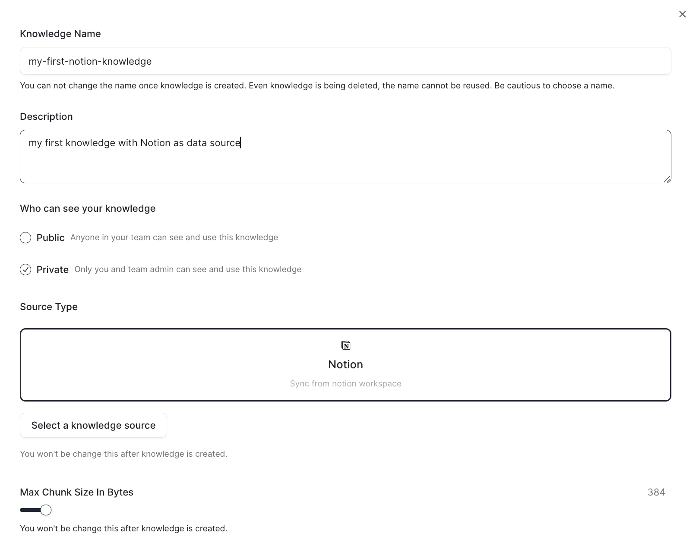
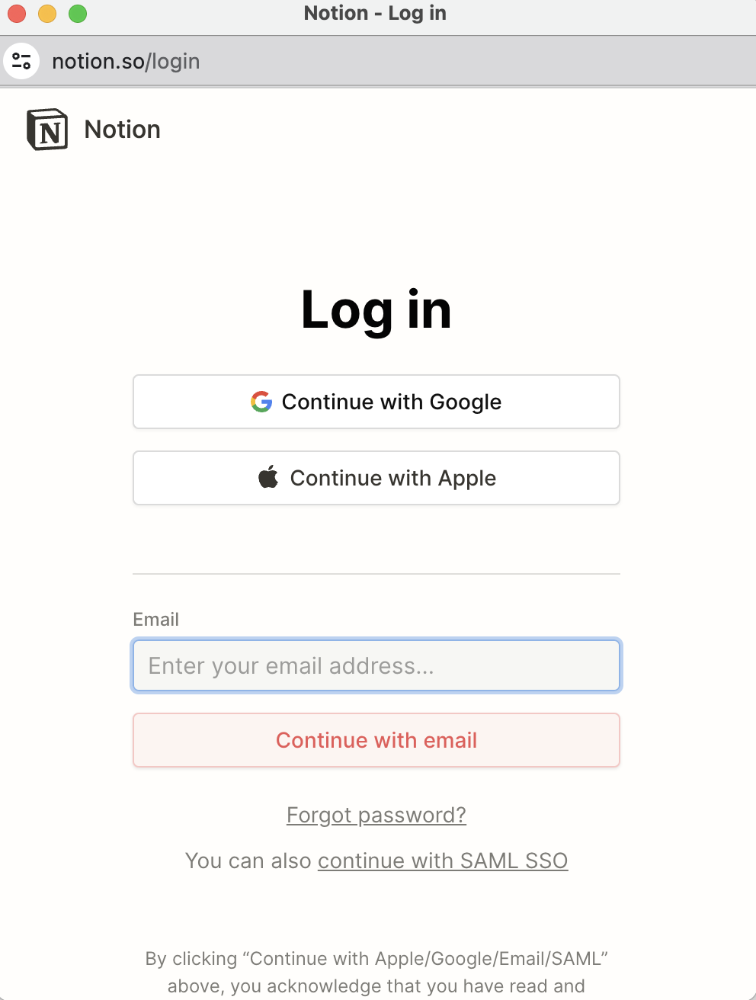
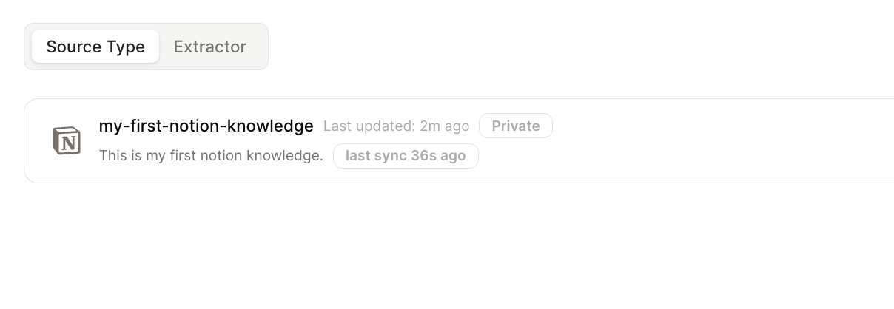

# 知识库类型

支持多种数据源,包括:本地文件、Notion、Github、Discord等。

## 本地文件

您可以上传文件并将它们存储在知识库中。

支持的文件类型: DOC, DOCX, IMG, EPUB, JPEG, JPG, PNG, XLS, XLSX, PPT, PPTX, MD, TXT, RTF, MD, TXT, RTF, RST, PDF, JSON, HTML, EML

## Notion

连接您的Notion账户并将Notion页面导入到知识库中。

* 选择Notion作为您知识库的数据源。

<figure></figure>

* 在弹出页面中,登录您的Notion账户并选择您想要导入到知识库的页面。

<figure></figure>

* 我们与Notion保持同步,确保内容及时更新。

<figure></figure>

<!-- ## Github

## Discord -->