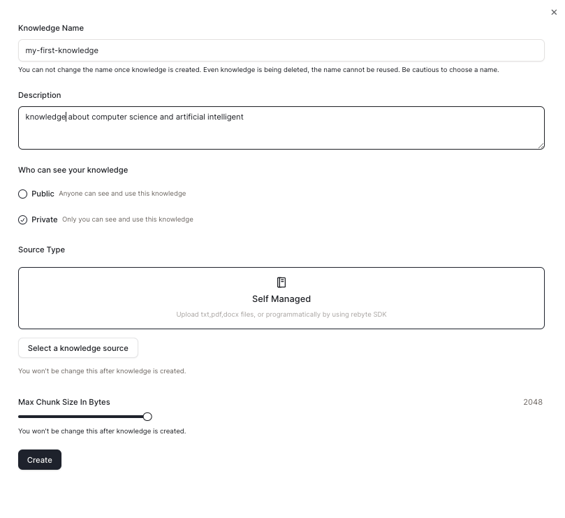
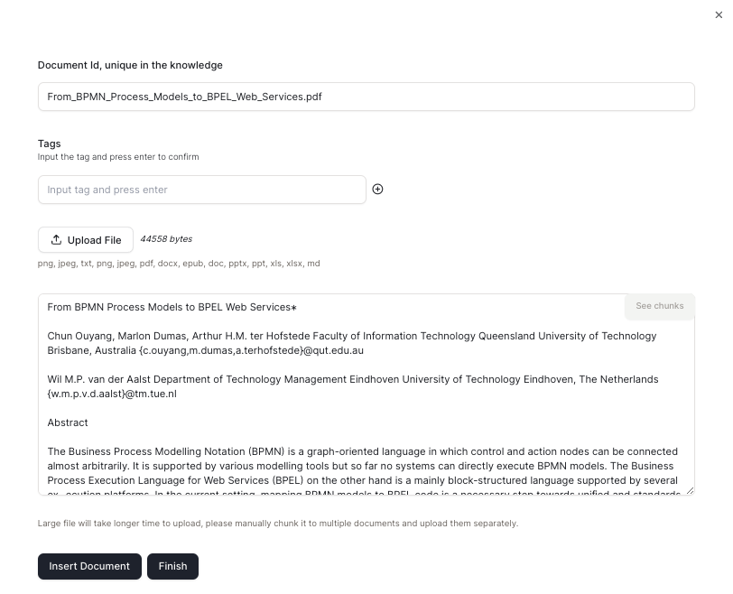
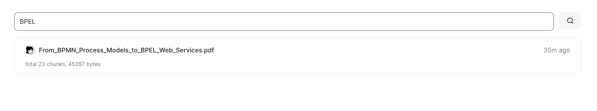
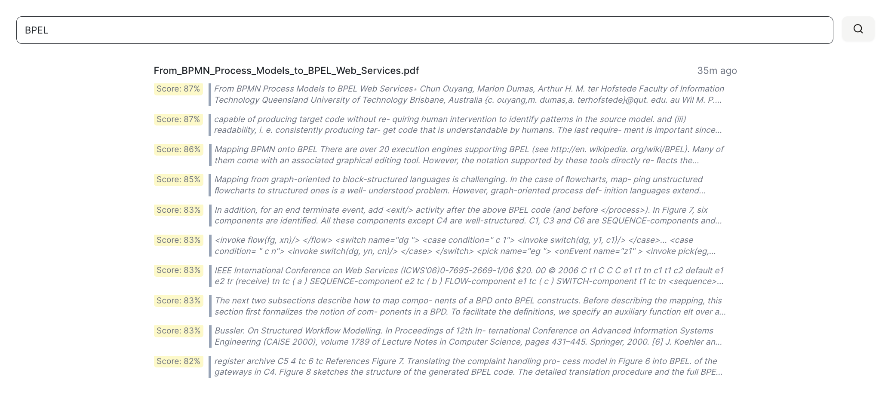
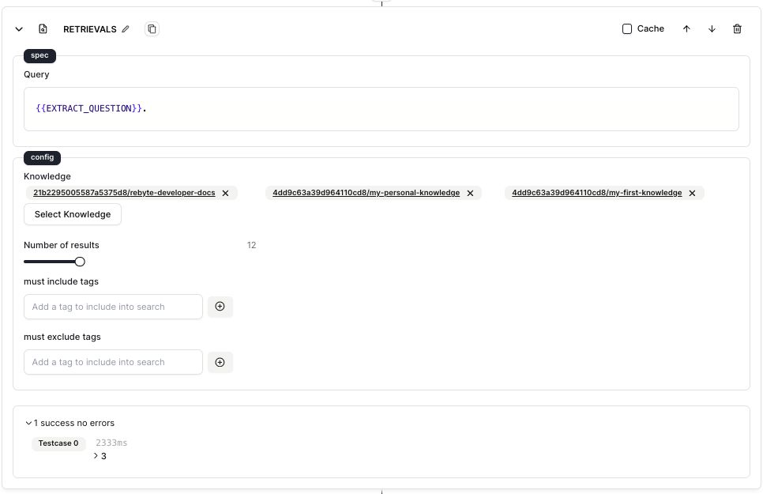

# 快速入门

这里我们告诉您如何创建和使用知识库。

## 步骤1: 创建知识库

* 在侧边栏导航到"知识库"标签,然后点击"创建知识库"。

* 填写知识库信息并选择知识库的源类型。这里我们选择"自我管理",因为我们将使用本地文件。

<figure></figure>

## 步骤2: 上传文件

* 点击"上传文件"并上传您的本地文件。

* 上传后,我们将为您的文件生成一个唯一的文档ID。

* 点击"插入文档"以上传此文件。

<figure></figure>

**现在您已经创建了您的第一个知识库!**

## 步骤3: 使用您的知识库

* 您可以在**搜索框**中搜索知识库并按回车键。

<figure></figure>

<figure><figcaption>搜索结果</figcaption></figure>

或者您可以在您的**代理**中使用知识库(如步骤4所示)。

## 步骤4: 在代理中使用知识库

* 使用"搜索知识库"操作并选择您想要使用的知识库。

<figure><figcaption>搜索结果</figcaption></figure>

* 您可以填写知识库搜索的查询,并设置您想要获得的查询结果数量。

<figure></figure>

* 结果与在"知识库"页面中搜索的结果相同

