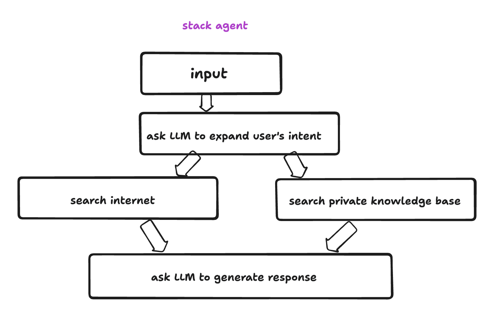

# 代理和知识

## 代理

> 助手的后端子程序

在 imprai 中，我们将代理定义为可以在云上运行的无服务器 API。通常，代理会利用 AI 模型来执行某些任务并展示其智能，但这并不是必需的。不使用 AI 模型的代理与普通的无服务器 API 类似，但在这里我们主要关注 AI 代理。

以下是 AI 代理的典型示例：

- 根据用户的查询，从用户的知识库中找出最相关的信息，然后总结结果并返回给用户
- 用户用自然语言描述数据库查询，代理将该查询翻译成 SQL，在用户的数据库上执行，然后总结结果并返回给用户
- 用户用自然语言描述翻译任务，代理执行翻译并评估翻译质量。如果质量不够好，则重复翻译过程直到达到足够的质量

### 典型的代理工作流程

<figure><figcaption></figcaption></figure>

- 代理是一系列可以在 LLM 无服务器运行时上执行的操作。这是 imprai 的核心构建块，也是终端用户创建自己的代理的主要方式。imprai 为终端用户提供了一个 GUI 构建器来创建和编辑他们自己的 LLM 代理。我们还提供了一个预构建的常见用例操作列表，以及一个私有 SDK，供软件工程师构建自己的操作并与代理构建器无缝集成。预构建的操作包括：

  - LLM 操作
    <!-- - 语言模型完成接口 -->
    - 语言模型聊天接口
  - 数据操作
    - 数据集加载器：加载预定义的数据集以供后续处理
    - 文件加载器：提取/转换/加载用户提供的文件
    - 语义搜索：在用户的知识库上搜索相似内容
  - 代理操作
    - 搜索引擎：在 Google 或 Bing 上搜索信息
    - 网络爬虫：爬取网页并提取信息
    - Http 请求生成器：向任何公共或私有 API 发送 http 请求
  - 控制流操作
    - 循环处理：循环执行直到满足条件
    - 并行处理：并行执行多个操作
    - 原生 Javascript：执行任意原生 Javascript 代码（对纯数据转换很有用）

## 知识 - 获取私有数据

> 助手的要素

- 知识是存储在 imprai 管理的向量数据库中的私有数据。imprai 目前为终端用户提供以下连接器来导入知识：
  - 本地文件，支持的文件类型包括：
    - doc, docx, img, epub, jpeg, jpg, png, xls, xlsx, ppt, pptx, md, txt, rtf, rst, pdf, json, html
  - Notion
  - Discord
  - GitHub
  - 更多连接器即将推出
  - 知识可以用于 LLM 代理中的语义搜索和数据增强。一个很好的例子是利用知识在用户的私有知识库上进行语义搜索，然后使用搜索结果来增强语言模型的数据，这就是所谓的**检索增强生成（Retrieval Augmented Generation, RAG）**。
