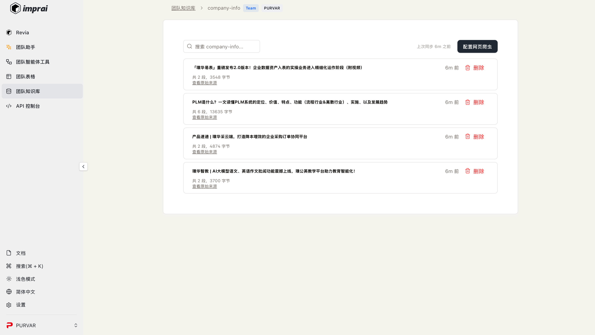

# 通过`英璞来`为你的公司主页构建一个AI智能客服助手

我们将利用英璞来平台构建公司知识库以及编排智能客服的工作流，再利用英璞来平台提供的API接口与公司首页对接，让我们的公司首页具备智能客服能力。

## 1. 创建公司知识库

打开**英璞来**，进入**开发者平台**，点击**团队知识库**，点击**创建知识库**

输入知识库相关信息说明，可参考图中内容,这里我们以上传网页链接为例，请选择来源类型为网页

<figure></figure>

创建成功后即可添加网页链接，点击**配置网页爬虫**，添加网页链接，这里我们以添加4个微信公众号文章为例，添加后点击保存，等待平台配置爬虫，刷新即可查看爬取结果

https://mp.weixin.qq.com/s/zTl2NB7d-O6HwYPaDWV7FA
https://mp.weixin.qq.com/s/OAFUsVvrpGOYF9HUn1u_5A
https://mp.weixin.qq.com/s/Qlqa70Kgv0I9MZGucxGMEw
https://mp.weixin.qq.com/s/1haCzXgsYEp6rGVGz6N7Sw

<figure></figure>

自此，我们的公司知识库创建完成，接下来我们创建智能客服

## 2. 创建智能客服

打开**英璞来**，进入**开发者平台**，点击**团队智能体工具**，点击**创建智能体**

输入智能体名称，这里我们以purvar_intelligent_agent为例，选择任意模板，创建成功后删除已有模块，重新开始编排

### 在最上方智能体名称旁选择`数据集`，设置测试用例数据,创建数据集chatbot_dataset

<figure></figure>
<figure></figure>


```json
[
  {
    "role": "user",
    "content": "璞华科技是一家什么样的公司？"
  }
]
```

### 回到`设计`页面，点击`功能模块Runnable Action`下拉菜单，新建`输入Input`模块，将测试用例数据集选择刚刚创建的chatbot_dataset

<figure></figure>

### 点击`功能模块Runnable Action`下拉菜单，新建`代码动作Code`模块EXTRACT_QUESTION获取问题信息

```javascript
_fun = (env) => {
  // 使用 `env.state.Action_NAME` 来引用之前动作的输出
  return env.state.INPUT.messages.slice(-1)[0].content
}
```

<figure></figure>


### 新建`代码动作Code`模块MESSAGES将问题打包为标准代码格式

```javascript
const _fun = (env) => {
    return env.state.INPUT.messages.map((msg) => {
    return {
      role: msg.role,
      content: msg.content || "",
    }
  })
}

```

<figure></figure>


### 点击`功能模块Runnable Action`下拉菜单，新建`知识搜索Search Knowledge`模块RETRIEVALS

<figure></figure>

在“查询”代码框中输入下列内容

```javascript
{{EXTRACT_QUESTION}}.  
```

选择知识为公司知识库company_info


### 新建`代码动作Code`模块RETRIEVALS_RESULT包装检索结果

```javascript
const _fun = (env) => {
  const acc = env.state.RETRIEVALS.reduce((acc, curr) => {
    const documentText = curr.chunks.map((chunk) => chunk.text).join("\n")
    acc.push(
      `相关页面链接：${curr.document_id}\n${documentText}\n----------------------------------`
    )
    return acc
  }, [])

  return acc.join("\n").slice(0, 8000)
}
```

<figure></figure>


### 点击`功能模块Runnable Action`下拉菜单，新建`大模型LLM`模块调用大模型

指令可参考如下输入

```json
我是互联网产品的销售负责人。根据以下内容，根据用户的需求推荐产品或提出解决方案。回答中要包含产品链接。要根据事实回答，不提供虚假信息。不要根据你所知道的知识来回答，而要仅根据提供给你的知识来回答。如果没有相关产品，请说公司没有这个产品。例如，请说公司没有amazon。
{{RETRIEVALS_RESULT}}.
请务必使用中文回答。
```

消息代码框输入

```javascript
const _fun = (env) => {
  return env.state.MESSAGES
}
```

函数代码框与模型配置部分可保持默认设置

<figure></figure>

### 新建`代码动作Code`模块GET_ANSWER提取并包装大模型回答内容
```javascript
const _fun = (env) => {
  return {
    role: "assistant",
    content: env.state.OUTPUT_STREAM.message.content,
  }
}
```

### 点击`功能模块Runnable Action`下拉菜单，新建`输出Output`模块，将GET_ANSWER模块输出设置为最终输出


<figure></figure>

自此，我们的智能客服编排完成，接下来依次点击**运行测试用例**与**部署**

## 3. 公司首页接入智能客服

